本文章是基于瑞芯微RK3566芯片的khdvk_3566b开发板，进行标准系统相关功能的移植，主要包括产品配置添加，内核启动、升级，音频ADM化，Camera，TP，LCD，WIFI，BT，vibrator、sensor、图形显示模块的适配案例总结，以及相关功能的适配。

## 产品配置和目录规划

### 产品配置

在产品`//vendor/`目录下创建以kaihong名字命名的文件夹，并在kaihong文件夹下面新建产品命的文件夹khdvk_3566b。

在`//vendor/kaihong/khdvk_3566b`目录下创建config.json文件。该文件用于描述产品所使用的SOC以及所需的子系统。配置如下

```
{
  "product_name": "khdvk_3566b",
  "device_company": "kaihong",
  "device_build_path": "device/board/kaihong/build",
  "target_cpu": "arm",
  "type": "standard",
  "version": "3.0",
  "board": "khdvk_3566b",
  "enable_ramdisk": true,//是否支持ramdisk二级启动
  "build_selinux": true,// 是否支持selinux权限管理
  "subsystems": [
    {
      "subsystem": "arkui",
      "components": [
        {
          "component": "ace_engine_standard",
          "features": []
        },
        {
          "component": "napi",
          "features": []
        }
      ]
    },
    .
    .
    .
    {
      "subsystem": "thirdparty",
      "components": [
        {
          "component": "musl",
          "features": []
        }
      ]
    }
  ]
}
```

主要的配置内容包括：

1. product_device：配置所使用的SOC。
2. type：配置系统的级别，这里直接standard即可。
3. subsystems：系统需要启用的子系统。子系统可以简单理解为一块独立构建的功能块。

已定义的子系统可以在`//build/subsystem_config.json`中找到。当然你也可以定制子系统。

这里建议先拷贝Hi3516DV300开发板的配置文件，删除掉hisilicon_products这个子系统。这个子系统为Hi3516DV300 SOC编译内核，不适合rk3566

### 目录规划

参考https://gitee.com/openharmony-sig/sig-content/blob/master/devboard/docs/board-soc-arch-design.md，并把芯片适配目录规划为：

```
device
├── board                                --- 单板厂商目录
│   └── kaihong                          --- 单板厂商名字：
│       └── khdvk_3566b                  --- 单板名：khdvk_3566b，主要放置开发板相关的驱动业务代码
└── soc                                  --- SoC厂商目录
    └── rockchip                         --- SoC厂商名字：rockchip
        └── rk3566                       --- SoC Series名：rk3566,主要为芯片原厂提供的一些方案，以及闭源库等


vendor
└── kaihong                              --- 开发产品样例厂商目录
    └── khdvk_3566b                      --- 产品名字：产品、hcs以及demo相关
```

## 内核启动

### 二级启动

二级启动简单来说就是将之前直接挂载sytem，从system下的init启动，改成先挂载ramdsik，从ramdsik中的init 启动，做些必要的初始化动作，如挂载system,vendor等分区，然后切到system下的init。

Rk3566适配主要是将主线编译出来的ramdisk打包到boot.img中，主要有以下工作：

1.使能二级启动

在//vendor/kaihong/khdvk_3566b/config.json中使能enable_ramdisk。

```
{
  "product_name": "khdvk_3566b",
  "device_company": "kaihong",
  "device_build_path": "device/board/kaihong/build",
  "target_cpu": "arm",
  "type": "standard",
  "version": "3.0",
  "board": "khdvk_3566b",
  "enable_ramdisk": true,//是否支持ramdisk二级启动
  "build_selinux": true,// 是否支持selinux权限管理
```

2.把主线编译出来的ramdsik.img 打包到boot.img

配置：

由于rk 启动uboot 支持从ramdisk 启动，只需要在打包boot_linux.img 的配置文件中增加ramdisk.img，因此没有使用主线的its格式，具体配置就是在内核编译脚本make-ohos.sh中增加:

```
function make_extlinux_conf()
{
    dtb_path=$1
    uart=$2
    image=$3

    echo "label rockchip-kernel-5.10" > ${EXTLINUX_CONF}
    echo "    kernel /extlinux/${image}" >> ${EXTLINUX_CONF}
    echo "    fdt /extlinux/${TOYBRICK_DTB}" >> ${EXTLINUX_CONF}
    if [ "enable_ramdisk" == "${ramdisk_flag}" ]; then
        echo "    initrd /extlinux/ramdisk.img" >> ${EXTLINUX_CONF}
    fi
    cmdline="append earlycon=uart8250,mmio32,${uart} root=PARTUUID=614e0000-0000-4b53-8000-1d28000054a9 rw rootwait rootfstype=ext4"
    echo "  ${cmdline}" >> ${EXTLINUX_CONF}
}
```

### 打包

增加了打包boot镜像的脚本make-boot.sh，供编译完ramdisk，打包boot 镜像时调用，主要内容:

```
genext2fs -B ${blocks} -b ${block_size} -d boot_linux -i 8192 -U boot_linux.img
```

调用make-boot.sh的修改可以参考如下pr：

https://gitee.com/openharmony/build/pulls/569/files

### INIT配置

init相关配置请参考[启动子系统的规范要求](https://gitee.com/openharmony/docs/blob/master/zh-cn/readme/启动恢复子系统.md)即可

## **音频**

##### khdvk_3566b Audio硬件结构图

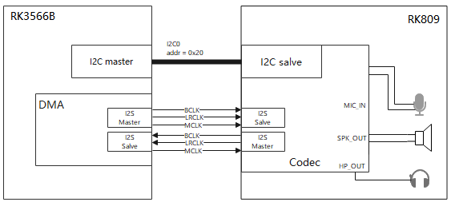

##### khdvk_3566b平台Audio驱动框架图

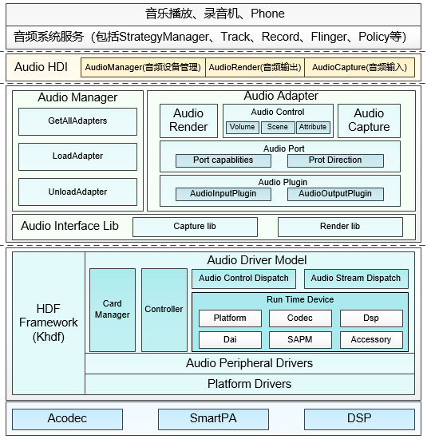

1. HDI adapter

实现Audio HAL层驱动（HDI接口适配），给Audio服务（frameworks）提供所需的音频硬件驱动能力接口。包含 Audio Manager、Audio Adapter、Audio Control、Audio Capture、Audio Render等接口对象。

2. Audio Interface Lib

配合内核中的Audio Driver Model使用，实现音频硬件的控制、录音数据的读取、播放数据的写入。它里面包括Stream_ctrl_common 通用层，主要是为了和上层的audio HDI adapter层进行对接。

3. ADM（Audio Driver Model）

音频驱动框架模型，向上服务于多媒体音频子系统，便于系统开发者能够更便捷的根据场景来开发应用。向下服务于具体的设备厂商，对于Codec和DSP设备厂商来说，可根据ADM模块提供的向下统一接口适配各自的驱动代码，就可以实现快速开发和适配OpenHarmony系统。

4. Audio Control Dispatch

接收lib层的控制指令并将控制指令分发到驱动层。

5. Audio Stream Dispatch

接收lib层的数据并将数据分发到驱动层

6. Card Manager

多声卡管理模块，每个声卡含有Dai、Platform、Codec、Accessory、Dsp、SAPM模块。

7. Platform Drivers

驱动适配层。

8. SAPM（Smart Audio Power Manager）

电源管理模块，对整个ADM电源进行功耗策略优化。

### Audio 驱动开发

这里以khdvk_3566b为例，讲述Audio驱动开发，其涉及到的模块驱动主要有：Codec驱动、platform驱动、Dai驱动。
相关代码路径如下：

    device/board/kaihong/khdvk_3566b/audio_drivers/codec/rk809_codec/
    device/board/kaihong/khdvk_3566b/audio_drivers/codec/dai/
    device/board/kaihong/khdvk_3566b/audio_drivers/codec/soc/

HDF HCS配置路径如下：

    vendor/kaihong/khdvk_3566b/hdf_config/khdf/device_info/
    vendor/kaihong/khdvk_3566b/hdf_config/khdf/audio/ 

Audio 驱动开发流程：

    step1:配置各个模块的HCS
    step2：修改各个模块的编译文件
    step3:配置各个模块的函数操作集
    step4:进行功能调试

#### Audio驱动开发实例

##### codec驱动开发实例

代码路径：
    device/board/kaihong/khdvk_3566b/audio_drivers/codec/rk809_codec/

1. 将codec注册绑定到HDF框架中,moduleName与device_info.hcs中的moduleName匹配
   
    struct HdfDriverEntry g_Rk809DriverEntry = {
   
        .moduleVersion = 1,
        .moduleName = "CODEC_RK809",
        .Bind = Rk809DriverBind,
        .Init = Rk809DriverInit,
        .Release = RK809DriverRelease,
   
    };
   
    HDF_INIT(g_Rk809DriverEntry);

2. Codec模块需要填充下面三个结构体：

g_codecData：codec设备的操作函数集和私有数据集。

g_codecDaiDeviceOps：codecDai的操作函数集，包括启动传输和参数配置等函数接口。

g_codecDaiData：codec的数字音频接口的操作函数集和私有数据集。

    struct CodecData g_rk809Data = {
        .Init = Rk809DeviceInit,
        .Read = RK809CodecReadReg,
        .Write = Rk809CodecWriteReg,
    };
    
    struct AudioDaiOps g_rk809DaiDeviceOps = {
        .Startup = Rk809DaiStartup,
        .HwParams = Rk809DaiHwParams,
        .Trigger = Rk809NormalTrigger,
    };
    
    struct DaiData g_rk809DaiData = {
        .DaiInit = Rk809DaiDeviceInit,
        .ops = &g_rk809DaiDeviceOps,
    };

1>  CodecData结构体操作函数的实现

    int32_t Rk809DeviceInit(struct AudioCard *audioCard, const struct CodecDevice *device)
    {
         ......  
        //get和set功能注册 
        if (CodecSetCtlFunc(device->devData, RK809GetCtrlOps, RK809SetCtrlOps) != HDF_SUCCESS) {
           AUDIO_DRIVER_LOG_ERR("AudioCodecSetCtlFunc failed.");
           return HDF_FAILURE;
        }
       //codec默认寄存器的初始化
       ret = RK809RegDefaultInit(device->devData->regCfgGroup);
       ......
       if (AudioAddControls(audioCard, device->devData->controls, device->devData->numControls) != HDF_SUCCESS) {
           AUDIO_DRIVER_LOG_ERR("add controls failed.");
           return HDF_FAILURE;
       }
       ......
    }
    /*读寄存器接口*/
    int32_t RK809CodecReadReg(const struct CodecDevice *codec, uint32_t reg, uint32_t *val)
    {
        ......
        if (Rk809DeviceRegRead(reg, val)) {
            AUDIO_DRIVER_LOG_ERR("read register fail: [%04x]", reg);
            return HDF_FAILURE;
        }
    
       return HDF_SUCCESS;
    }
     /*写寄存器接口*/
    int32_t Rk809CodecWriteReg(const struct CodecDevice *codec, uint32_t reg, uint32_t value)
    {
        if (Rk809DeviceRegWrite(reg, value)) {
            AUDIO_DRIVER_LOG_ERR("write register fail: [%04x] = %04x", reg, value);
            return HDF_FAILURE;
        }
    
        return HDF_SUCCESS;
    }

2> g_rk809DaiDeviceOps结构体的具体实现

    /*Rk809DaiStartup为启动时的一些设置*/
    int32_t Rk809DaiStartup(const struct AudioCard *card, const struct DaiDevice *device)
    {
        ......
        ret = RK809WorkStatusEnable(device->devData->regCfgGroup);
        ......
    }
    /*Rk809DaiHwParams为参数配置，包括采样率、位宽等。*/
    int32_t Rk809DaiHwParams(const struct AudioCard *card, const struct AudioPcmHwParams *param)
    {
        ......
        ret = AudioFormatToBitWidth(param->format, &bitWidth); 
        codecDaiParamsVal.frequencyVal = param->rate;
        codecDaiParamsVal.DataWidthVal = bitWidth;
    
        ret =  RK809DaiParamsUpdate(card->rtd->codecDai->devData->regCfgGroup, codecDaiParamsVal);
        ......
    }
    /*PCM流控制寄存器相关配置*/
    int32_t Rk809NormalTrigger(const struct AudioCard *card, int cmd, const struct DaiDevice *device)
    {
        g_cuurentcmd = cmd;
        switch (cmd) {
            case AUDIO_DRV_PCM_IOCTL_RENDER_START:
            case AUDIO_DRV_PCM_IOCTL_RENDER_RESUME:
                RK809DeviceRegConfig(rk817_render_start_regmap_config);
            break;
    
           case AUDIO_DRV_PCM_IOCTL_RENDER_STOP:
           case AUDIO_DRV_PCM_IOCTL_RENDER_PAUSE:
               RK809DeviceRegConfig(rk817_render_stop_regmap_config);
               break;
    
           case AUDIO_DRV_PCM_IOCTL_CAPTURE_START:
           case AUDIO_DRV_PCM_IOCTL_CAPTURE_RESUME:
              RK809DeviceRegConfig(rk817_capture_start_regmap_config);
              break;
    
           case AUDIO_DRV_PCM_IOCTL_CAPTURE_STOP:
           case AUDIO_DRV_PCM_IOCTL_CAPTURE_PAUSE:
                RK809DeviceRegConfig(rk817_capture_stop_regmap_config);
             break;
    
           default:
             break;
      }
    
      return HDF_SUCCESS;
    }

3. 完成 bind、init和release函数的实现

HdfDriverEntry结构体的具体填充：

    /*获取codec service,以及注册codec*/
    static int32_t Rk809DriverInit(struct HdfDeviceObject *device)
    {
       ......
       CodecGetConfigInfo(device, &(g_chip->codec)) 
       CodecSetConfigInfo(&(g_chip->codec),  &(g_chip->dai)
       GetServiceName(device)
       CodecGetDaiName(device,  &(g_chip->dai.drvDaiName)
       OsalMutexInit(&g_rk809Data.mutex);
       AudioRegisterCodec(device, &(g_chip->codec), &(g_chip->dai)
       ......
    }   
    /*将codec service绑定到HDF*/
    static int32_t Rk809DriverBind(struct HdfDeviceObject *device)
    {
        struct CodecHost *codecHost;
        ......
        codecHost = (struct CodecHost *)OsalMemCalloc(sizeof(*codecHost));
        ......
        codecHost->device = device;
        device->service = &codecHost->service;
       return HDF_SUCCESS;
    }
    /*释放资源*/
    static void RK809DriverRelease(struct HdfDeviceObject *device)
    {
       struct CodecHost *codecHost;
       ......
       codecHost = (struct CodecHost *)device->service;
       if (codecHost == NULL) {
           HDF_LOGE("CodecDriverRelease: codecHost is NULL");
           return;
       }
       OsalMemFree(codecHost);
    }

4. 配置codec hcs文件
   
   1> vendor/kaihong/khdvk_3566b/hdf_config/khdf/device_info/device_info.hcs

相关配置如下：

    device_codec :: device {
                device0 :: deviceNode {
                    policy = 1;
                    priority = 50;
                    preload = 0;
                    permission = 0666;
                    moduleName = "CODEC_RK809";
                    serviceName = "codec_service_0";
                    deviceMatchAttr = "hdf_codec_driver";
                }
    }

2> vendor/kaihong/khdvk_3566b/hdf_config/khdf/audio/codec_config.hcs

该文件涉及音量、静音模式、mic、通道模式等相关寄存器配置    

##### DAI驱动开发实例

   代码路径：

    device/board/kaihong/khdvk_3566b/audio_drivers/codec/dai/

1. 将I2S驱动注册绑定到HDF框架中，代码片段如下，启动moduleName与HCS文件的中moduleName一致
   
    struct HdfDriverEntry g_daiDriverEntry = {
   
        .moduleVersion = 1,
        .moduleName = "DAI_RK3568",
        .Bind = DaiDriverBind,
        .Init = DaiDriverInit,
        .Release = DaiDriverRelease,
   
    };
    HDF_INIT(g_daiDriverEntry);

2. DAI模块需要填充下面两个结构体

g_daiData：dai设备私有配置，其中包含dai设备的初始化、读写寄存器、操作函数。

g_daiDeviceOps：dai设备操作函数集，包含了dai的参数设置、触发、启动。

    struct AudioDaiOps g_daiDeviceOps = {
        .Startup = Rk3568DaiStartup,
        .HwParams = Rk3568DaiHwParams,
        .Trigger = Rk3568NormalTrigger,
    };
    
    struct DaiData g_daiData = {
        .Read = Rk3568DeviceReadReg,
        .Write = Rk3568DeviceWriteReg,
        .DaiInit = Rk3568DaiDeviceInit,
        .ops = &g_daiDeviceOps,
    };

1> AudioDaiOps结构体的具体填充

    /*Rk3568DaiHwParams中主要完成一些pcm流信息的设置*/
    int32_t Rk3568DaiHwParams(const struct AudioCard *card, const struct AudioPcmHwParams *param)
    {
         ......  
         data->pcmInfo.channels = param->channels;
    
         if (AudioFormatToBitWidth(param->format, &bitWidth) != HDF_SUCCESS) {
             AUDIO_DEVICE_LOG_ERR("AudioFormatToBitWidth error");
             return HDF_FAILURE;
         }
    
         data->pcmInfo.bitWidth = bitWidth;
         data->pcmInfo.rate = param->rate;
         data->pcmInfo.streamType = param->streamType;
    
         i2sTdm = dev_get_drvdata(&platformdev->dev);
         ret = RK3568I2sTdmSetSysClk(i2sTdm, param);
         if (ret != HDF_SUCCESS) {
             AUDIO_DEVICE_LOG_ERR("RK3568I2sTdmSetSysClk error");
             return HDF_FAILURE;
         }
         ret = RK3568I2sTdmSetMclk(i2sTdm, &mclk, param);
         if (ret != HDF_SUCCESS) {
             AUDIO_DEVICE_LOG_ERR("RK3568I2sTdmSetMclk error");
             return HDF_FAILURE;
         }
         AUDIO_DEVICE_LOG_DEBUG("success");
         return HDF_SUCCESS;
    }
    int32_t Rk3568NormalTrigger(const struct AudioCard *card, int cmd, const struct DaiDevice *device)
    {
        ......
        Rk3568TxAndRxSetReg(i2sTdm, streamType, triggerFlag);
        ......
    }

2> DaiData结构体的具体填充

    /*封装linux内核的读寄存器接口*/
    int32_t Rk3568DeviceReadReg(const struct DaiDevice *dai, uint32_t reg, uint32_t *val)
    {
        ......
        if (regmap_read(i2sTdm->regmap, reg, val)) {
        ......
    }
    /*封装linux内核的写寄存器接口*/  
    int32_t Rk3568DeviceWriteReg(const struct DaiDevice *dai, uint32_t reg, uint32_t value)
    {
        ......
        if (regmap_write(i2sTdm->regmap, reg, value)) {
        ......
    }
    /*dai 设备的初始化*/
    int32_t Rk3568DaiDeviceInit(struct AudioCard *card, const struct DaiDevice *dai)

3. 完成 bind、init和release函数的实现

HdfDriverEntry结构体中的bind、init、release具体填充：

    static int32_t DaiDriverInit(struct HdfDeviceObject *device)
    {
        ......
        DaiGetConfigInfo(device, &g_daiData)
        DaiGetServiceName(device)
        AudioSocRegisterDai(device, (void *)&g_daiData);
        ......
    }
    static int32_t DaiDriverBind(struct HdfDeviceObject *device)
    {
        ......
        daiHost->device = device;
        device->service = &daiHost->service;
        g_daiData.daiInitFlag = false;
        ......
    }
    static void DaiDriverRelease(struct HdfDeviceObject *device)
    {
        ......
        OsalMutexDestroy(&g_daiData.mutex);
        daiHost = (struct DaiHost *)device->service;
        OsalMemFree(daiHost);
        ......
    }

4.配置dai hcs文件

1> vendor/kaihong/khdvk_3566b/hdf_config/khdf/device_info/device_info.hcs

    device_dai0 :: device {
        device0 :: deviceNode {
            policy = 1;
            priority = 50;
            preload = 0;
            permission = 0666;
            moduleName = "DAI_RK3568";
            serviceName = "dai_service";
            deviceMatchAttr = "hdf_dai_driver";
        }
    }

2> vendor/kaihong/khdvk_3566b/hdf_config/khdf/audio/dai_config.hcs

该文件涉及I2S时序、配置参数以及rk809使能等相关寄存器配置

##### Platform驱动开发实例

1. 将DMA驱动注册到HDF框架中，代码片段如下，启动moduleName与HCS文件的中moduleName一致
   
    struct HdfDriverEntry g_platformDriverEntry = {
   
        .moduleVersion = 1,
        .moduleName = "DMA_RK3568",
        .Bind = PlatformDriverBind,
        .Init = PlatformDriverInit,
        .Release = PlatformDriverRelease,
   
    };
    HDF_INIT(g_platformDriverEntry);

2. DMA模块需要填充下面两个结构体
   
    struct AudioDmaOps g_dmaDeviceOps = {
   
        .DmaBufAlloc = Rk3568DmaBufAlloc, //dma内存申请函数接口
        .DmaBufFree = Rk3568DmaBufFree,   // dma内存释放函数接口
        .DmaRequestChannel = Rk3568DmaRequestChannel,  // dma申请通道函数接口
        .DmaConfigChannel = Rk3568DmaConfigChannel,    // dma通道配置函数接口
        .DmaPrep = Rk3568DmaPrep,             // dma准备函数接口
        .DmaSubmit = Rk3568DmaSubmit,         // dma submit函数接口
        .DmaPending = Rk3568DmaPending,       // dma pending函数接口
        .DmaPause = Rk3568DmaPause,           // dma暂停、停止函数接口
        .DmaResume = Rk3568DmaResume,         // dma恢复函数接口
        .DmaPointer = Rk3568PcmPointer,       // dma获取当前播放或录音位置函数接口
   
    };
   
    struct PlatformData g_platformData = {
   
        .PlatformInit = AudioDmaDeviceInit,   // dma设备初始化接口
        .ops = &g_dmaDeviceOps,
   
    };

3. 完成 bind、init和release函数的实现

HdfDriverEntry结构体中的bind、init、release具体填充：

    static int32_t PlatformDriverInit(struct HdfDeviceObject *device)
    {
        ......
        PlatformGetServiceName(device);
        AudioSocRegisterPlatform(device, &g_platformData)
        ......
    }
    static int32_t PlatformDriverBind(struct HdfDeviceObject *device)
    {
        ......
        platformHost->device = device;
        device->service = &platformHost->service;
        ......
    }
    static void PlatformDriverRelease(struct HdfDeviceObject *device)
    {
       ......
       platformHost = (struct PlatformHost *)device->service;
       OsalMemFree(platformHost);
       ......
    }

4. 配置dma hcs文件

1> vendor/kaihong/khdvk_3566b/hdf_config/khdf/device_info/device_info.hcs

相关配置如下：

     device_dma :: device {
         device0 :: deviceNode {
             policy = 1;
             priority = 50;
             preload = 0;
             permission = 0666;
             moduleName = "DMA_RK3568";
             serviceName = "dma_service_0";
             deviceMatchAttr = "hdf_dma_driver";
         }
     }

2> vendor/kaihong/khdvk_3566b/hdf_config/khdf/audio/dma_config.hcs

没有特殊参数需要配置，一般情况下不需改动。

Makefile和Kconfig配置文件

文件路径：

    drivers/adapter/khdf/linux/model/audio

Makefile文件相关内容：

    obj-$(CONFIG_DRIVERS_HDF_AUDIO_RK3566) += \
          $(KHDF_AUDIO_RK3566_DIR)/codec/rk809_codec/src/rk809_codec_adapter.o \
          $(KHDF_AUDIO_RK3566_DIR)/codec/rk809_codec/src/rk809_codec_impl.o \
          $(KHDF_AUDIO_RK3566_DIR)/codec/rk809_codec/src/rk809_codec_linux_driver.o \
          $(KHDF_AUDIO_RK3566_DIR)/dsp/src/rk3568_dsp_adapter.o \
          $(KHDF_AUDIO_RK3566_DIR)/dsp/src/rk3568_dsp_ops.o \
          $(KHDF_AUDIO_RK3566_DIR)/dai/src/rk3568_dai_adapter.o \
          $(KHDF_AUDIO_RK3566_DIR)/dai/src/rk3568_dai_ops.o \
          $(KHDF_AUDIO_RK3566_DIR)/dai/src/rk3568_dai_linux_driver.o \
          $(KHDF_AUDIO_RK3566_DIR)/soc/src/rk3568_dma_adapter.o \
          $(KHDF_AUDIO_RK3566_DIR)/soc/src/rk3568_dma_ops.o

Kconfig相关内容:

    config DRIVERS_HDF_AUDIO_RK3566
        bool "Enable HDF Audio Codec driver"
        default n
        depends on DRIVERS_HDF_AUDIO
        help
           Answer Y to choice HDF Audio Codec driver.

## **LCD**

khdvk_3566b平台默认支持一个mipi接口的lcd屏幕

LCD的适配主要依赖于HDF显示模型，显示驱动模型基于 HDF 驱动框架、Platform 接口及 OSAL 接口开发，可以屏蔽不同内核形态（LiteOS、Linux）差异，适用于不同芯片平台，为显示屏器件提供统一的驱动平台。

如图为 HDF Display驱动模型层次关系 

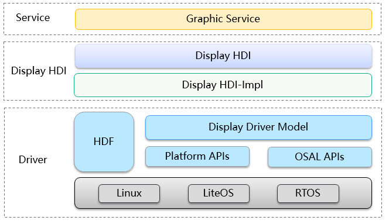

当前驱动模型主要部署在内核态中，向上对接到 Display 公共 hal 层，辅助 HDI 的实现。显示驱动通过 Display-HDI 层对图形服务暴露显示屏驱动能力；向下对接显示屏 panel 器件，驱动屏幕正常工作，自上而下打通显示全流程通路。

所以LCD的适配主要在于LCD panel器件驱动的适配

器件驱动的适配分为2部分：panel驱动和hcs配置

涉及的文件有：

    drivers/framework/model/display/driver/panel
    vendor/kaihong/khdvk_3566b/hdf_config/khdf/device_info
    vendor/kaihong/khdvk_3566b/hdf_config/khdf/input

### panel驱动

器件驱动主要围绕如下接口展开：

    struct PanelData {
        struct HdfDeviceObject *object;
        int32_t (*init)(struct PanelData *panel);
        int32_t (*on)(struct PanelData *panel);
        int32_t (*off)(struct PanelData *panel);
        int32_t (*prepare)(struct PanelData *panel);
        int32_t (*unprepare)(struct PanelData *panel);
        struct PanelInfo *info;
        enum PowerStatus powerStatus;
        struct PanelEsd *esd;
        struct BacklightDev *blDev;
        void *priv;
    };

驱动中在初始化接口中实例化该结构体：

    panelSimpleDev->panel.init = PanelSimpleInit;
    panelSimpleDev->panel.on = PanelSimpleOn;
    panelSimpleDev->panel.off = PanelSimpleOff;
    panelSimpleDev->panel.prepare = PanelSimplePrepare;
    panelSimpleDev->panel.unprepare = PanelSimpleUnprepare;
    
    static void PanelResInit(struct panel_jdi_gt911_dev *panel_dev)
    {
       ......   
       panel_dev->panel.info = &g_panelInfo;
       panel_dev->panel.init = PanelInit;
       panel_dev->panel.on = PanelOn;
       panel_dev->panel.off = PanelOff;
       panel_dev->panel.prepare = PanelPrepare;
       panel_dev->panel.unprepare = PanelUnprepare;
       ...... 
    }

g_panelInfo配置panel基础参数

PanelInit负责panel的软件初始化

PanelOn负责亮屏

PanelOff负责灭屏

PanelPrepare负责亮屏的硬件时序初始化

PanelUnprepare负责灭屏的硬件时序初始化

实例化后使用RegisterPanel接口向display模型注册该panel驱动即可

需要说明的是，khdvk_3566b上的这款lcd使用的时候DRM显示框架

### hcs配置

    device3 :: deviceNode {
           policy = 0;
           priority = 100;
           preload = 0;
           moduleName = "LCD_MIPI_JDI_GT911";
    }

### 背光

背光控制分为原生linux内核框架下背光驱动以及基于HDF框架开发的背光驱动模型。

rk3566背光是通过pwm控制占空比实现的，具体使用的是pwm4

linux背光驱动代码路径：

    linux-5.10/drivers/video/backlight/pwm_bl.c
    linux-5.10/drivers/video/backlight/backlight.c
    linux-5.10/drivers/pwm/pwm-rockchip.c

使用HDF框架下的背光驱动，需要关闭原生驱动

    # CONFIG_BACKLIGHT_PWM is not set

### HDF实现

基于HDF框架开发的背光驱动模型，如下图：


代码路径:

    drivers/framework/model/display/driver/backlight/hdf_bl.c

HDF BL入口函数:

    static int32_t BacklightInit(struct HdfDeviceObject *object)
    {
         if (object == NULL) {
         HDF_LOGE("%s: object is null!", __func__);
         return HDF_FAILURE;
         }
    
         HDF_LOGI("%s success", __func__);
         return HDF_SUCCESS;
    }
    
    struct HdfDriverEntry g_blDevEntry = {
        .moduleVersion = 1,
        .moduleName = "HDF_BL",
        .Init = BacklightInit,
        .Bind = BacklightBind,
    };
    
    HDF_INIT(g_blDevEntry);

代码路径：

    drivers/framework/model/display/driver/backlight/pwm_bl.c

HDF PWM入口函数：

    struct HdfDriverEntry g_pwmBlDevEntry = {
    .moduleVersion = 1,
    .moduleName = "PWM_BL",
    .Init = BlPwmEntryInit,
    };
    HDF_INIT(g_pwmBlDevEntry);

具体控制背光的接口：

    static int32_t BlPwmUpdateBrightness(struct BacklightDev *blDev, uint32_t brightness)
    {
        int32_t ret;
        uint32_t duty;
        struct BlPwmDev *blPwmDev = NULL;
    
        blPwmDev = ToBlDevPriv(blDev);
        if (blPwmDev == NULL) {
            HDF_LOGE("%s blPwmDev is null", __func__);
            return HDF_FAILURE;
        }
    
        if (blPwmDev->props.maxBrightness == 0) {
            HDF_LOGE("%s maxBrightness is 0", __func__);
            return HDF_FAILURE;
        }
    
        if (brightness == 0) {
             return PwmDisable(blPwmDev->pwmHandle);
        }
    
        duty = (brightness * blPwmDev->config.period) / blPwmDev->props.maxBrightness;
        ret = PwmSetDuty(blPwmDev->pwmHandle, duty);
        if (ret != HDF_SUCCESS) {
            HDF_LOGE("%s: PwmSetDuty failed, ret %d", __func__, ret);
            return HDF_FAILURE;
        }
        return PwmEnable(blPwmDev->pwmHandle);
    }
    
    static struct BacklightOps g_blDevOps = {
         .updateBrightness = BlPwmUpdateBrightness,
    };

HDF PWM实现的调用的就是内核pwm的接口。


代码路径：

    drivers/framework/model/display/driver/panel/mipi_jdi_gt911.c

在LCD HDF器件驱动注册背光:

    panel_dev->panel.blDev = GetBacklightDev("hdf_pwm");
    if (panel_dev->panel.blDev == NULL) {
        HDF_LOGE("%s GetBacklightDev fail", __func__);
        goto FAIL;
    }

### HCS配置

驱动hcs配置：

    device_pwm_bl :: device {
        device0 :: deviceNode {
            policy = 0;
            priority = 95;
            preload = 0;
            moduleName = "PWM_BL";
            deviceMatchAttr = "pwm_bl_dev";
        }
    }
    device_backlight :: device {
        device0 :: deviceNode {
            policy = 2;
            priority = 90;
            preload = 0;
            permission = 0660;
            moduleName = "HDF_BL";
            serviceName = "hdf_bl";
        }
    }

pwm背光的hcs配置：

    root {
        backlightConfig {
            pwmBacklightConfig {
                match_attr = "pwm_bl_dev";
                pwmDevNum = 1;
                pwmMaxPeroid = 25000;
                backlightDevName = "hdf_pwm";
                minBrightness = 0;
                defBrightness = 127;
                maxBrightness = 255;
           }
       }
    }

### 测试

cat /sys/kernel/debug/pwm 来查看hdf pwm是否申请到pwm4

申请成功有如下结果：

requested 代表申请成功

enabled 代表pwm4使能成功

    # cat /sys/kernel/debug/pwm
    platform/fe6e0000.pwm, 1 PWM device
    pwm-0   (backlight           ): requested period: 25000 ns duty: 0 ns polarity: normal

## 显示适配

显示适配需要完成的工作：图形服务HDI接口适配、GPU适配、mipi dsi驱动适配

### 显示HDI

[显示HDI](https://gitee.com/openharmony/drivers_peripheral/blob/master/display/README_zh.md)对图形服务提供显示驱动能力，包括显示图层的管理、显示内存的管理及硬件加速等。 显示HDI需要适配两部分：gralloc 和 display_device。

OpenHarmony提供了使用与Hi3516DV300参考实现，厂商可根据实际情况参考适配，khdvk_3566b display适配是在//device/soc/rockchip/hardware/display目录下，仓名为[device_soc_rockchip](https://gitee.com/openharmony-sig/device_soc_rockchip)。

#### display gralloc适配

gralloc模块提供显示内存管理功能，该实现基于drm开发。

drm设备节点定义在//device/soc/rockchip/hardware/display/src/display_gralloc/display_gralloc_gbm.c文件中，根据khdvk_3566b实际情况修改了drm文件节点。

```
const char *g_drmFileNode = "/dev/dri/renderD128";
```

#### display device适配

display device模块提供显示设备管理、layer管理、硬件加速等功能。

1. display drm设备节点初始化，根据khdvk_3566b实际情况修改了drm设备名称。

```
//device/soc/rockchip/hardware/display/src/display_device/drm/drm_device.cpp
std::shared_ptr<HdiDeviceInterface> DrmDevice::Create()
{
    DISPLAY_DEBUGLOG();
    if (mDrmFd == nullptr) {
        const std::string name("rockchip");    // 将drm驱动设备名称修改为“rockchip”
        int drmFd = open("/dev/dri/card0", O_RDWR | O_CLOEXEC);  // 将drm驱动设备文件句柄修改为"/dev/dri/card0"
        if (drmFd < 0) {
            DISPLAY_LOGE("drm file:%{public}s open failed %{public}s", name.c_str(), strerror(errno));
            return nullptr;
        }
        DISPLAY_DEBUGLOG("the drm fd is %{public}d", drmFd);
        mDrmFd = std::make_shared<HdiFd>(drmFd);
    }
    if (mInstance == nullptr) {
        mInstance = std::make_shared<DrmDevice>();
    }
    return mInstance;
}
```

2. display硬件合成的修改

```
//device/soc/rockchip/hardware/display/src/display_gfx/display_gfx.c
```

硬件合成文件添加了颜色空间的支持模式

```
RgaSURF_FORMAT colorSpaceModeChange(PixelFormat color, uint8_t *isYuv)
{
    RgaSURF_FORMAT rkFormat;
    switch (color) {
        case PIXEL_FMT_RGB_565:          /**< RGB565 format */
            rkFormat = RK_FORMAT_RGB_565;
            *isYuv = 0;
            break;
        case PIXEL_FMT_RGBA_4444:        /**< RGBA4444 format */
            rkFormat = RK_FORMAT_RGBA_4444;
            *isYuv = 0;
            break;
        case PIXEL_FMT_RGBA_5551:        /**< RGBA5551 format */
            rkFormat = RK_FORMAT_RGBA_5551;
            *isYuv = 0;
            break;
        case PIXEL_FMT_RGBX_8888:        /**< RGBX8888 format */
            rkFormat = RK_FORMAT_RGBX_8888;
            *isYuv = 0;
            break;
        case PIXEL_FMT_RGBA_8888:        /**< RGBA8888 format */
            rkFormat = RK_FORMAT_RGBA_8888;
            *isYuv = 0;
            break;
        case PIXEL_FMT_RGB_888:          /**< RGB888 format */
            rkFormat = RK_FORMAT_RGB_888;
            *isYuv = 0;
            break;
        case PIXEL_FMT_BGR_565:          /**< BGR565 format */
            rkFormat = RK_FORMAT_BGR_565;
            *isYuv = 0;
            break;
        case PIXEL_FMT_BGRA_4444:        /**< BGRA4444 format */
            rkFormat = RK_FORMAT_BGRA_4444;
            *isYuv = 0;
            break;
        case PIXEL_FMT_BGRA_5551:        /**< BGRA5551 format */
            rkFormat = RK_FORMAT_BGRA_5551;
            *isYuv = 0;
            break;
        case PIXEL_FMT_BGRX_8888:        /**< BGRX8888 format */
            rkFormat = RK_FORMAT_BGRX_8888;
            *isYuv = 0;
            break;
        case PIXEL_FMT_BGRA_8888:        /**< BGRA8888 format */
            rkFormat = RK_FORMAT_BGRA_8888;
            *isYuv = 0;
            break;
        case PIXEL_FMT_YCBCR_422_SP:     /**< YCBCR422 semi-planar format */
            rkFormat = RK_FORMAT_YCbCr_420_SP;
            *isYuv = 1;
            break;
        case PIXEL_FMT_YCRCB_422_SP:     /**< YCRCB422 semi-planar format */
            rkFormat = RK_FORMAT_YCrCb_422_SP;
            *isYuv = 1;
            break;
        case PIXEL_FMT_YCBCR_420_SP:     /**< YCBCR420 semi-planar format */
            rkFormat = RK_FORMAT_YCbCr_420_SP;
            *isYuv = 1;
            break;
        case PIXEL_FMT_YCRCB_420_SP:     /**< YCRCB420 semi-planar format */
            rkFormat = RK_FORMAT_YCrCb_420_SP;
            *isYuv = 1;
            break;
        case PIXEL_FMT_YCBCR_422_P:      /**< YCBCR422 planar format */
            rkFormat = RK_FORMAT_YCbCr_422_P;
            *isYuv = 1;
            break;
        case PIXEL_FMT_YCRCB_422_P:      /**< YCRCB422 planar format */
            rkFormat = RK_FORMAT_YCrCb_422_P;
            *isYuv = 1;
            break;
        case PIXEL_FMT_YCBCR_420_P:      /**< YCBCR420 planar format */
            rkFormat = RK_FORMAT_YCbCr_420_P;
            *isYuv = 1;
            break;
        case PIXEL_FMT_YCRCB_420_P:      /**< YCRCB420 planar format */
            rkFormat = RK_FORMAT_YCrCb_420_P;
            *isYuv = 1;
            break;
        case PIXEL_FMT_YUYV_422_PKG:     /**< YUYV422 packed format */
            rkFormat = RK_FORMAT_YUYV_422;
            *isYuv = 1;
            break;
        case PIXEL_FMT_UYVY_422_PKG:     /**< UYVY422 packed format */
            rkFormat = RK_FORMAT_UYVY_422;
            *isYuv = 1;
            break;
        case PIXEL_FMT_YVYU_422_PKG:     /**< YVYU422 packed format */
            rkFormat = RK_FORMAT_YUYV_422;
            *isYuv = 1;
            break;
        case PIXEL_FMT_VYUY_422_PKG:     /**< VYUY422 packed format */
            rkFormat = RK_FORMAT_VYUY_422;
            *isYuv = 1;
            break;
        default:
            rkFormat = RK_FORMAT_UNKNOWN;
            break;
    }
    return rkFormat;
}
```

在合成时增加了旋转90、180、270度

```
int32_t TransformTypeChange(TransformType type)
{
    int32_t rkRotateType;
    switch (type) {
        case ROTATE_90:            /**< Rotation by 90 degrees */
            rkRotateType = IM_HAL_TRANSFORM_ROT_90;
            break;
        case ROTATE_180:             /**< Rotation by 180 degrees */
            rkRotateType = IM_HAL_TRANSFORM_ROT_180;
            break;
        case ROTATE_270:             /**< Rotation by 270 degrees */
            rkRotateType = IM_HAL_TRANSFORM_ROT_270;
            break;
        default:
            rkRotateType = 0;        /**< No rotation */
            break;
    }
    return rkRotateType;
}
```

#### 测试验证

[hello_composer](https://gitee.com/openharmony/graphic_graphic_2d/tree/master/rosen/samples/composer)测试模块：Rosen图形框架提供的测试程序，主要显示流程，HDI接口等功能是否正常，默认随系统编译。

代码路径：

```
foundation/graphic/graphic_2d/rosen/samples/composer/
├── BUILD.gn
├── hello_composer.cpp
├── hello_composer.h
├── layer_context.cpp
├── layer_context.h
└── main.cpp
```

具体验证如下：

1. 关闭render service
   
   ```
   service_control stop render_service
   ```

2. 关闭 fondation进程
   
   ```
   service_control stop fondation
   ```

3. 运行hello_composer测试相关接口
   切换到/system/bin目录下，运行hello_composer测试命令
   
   ```
   #cd /system/bin
   #./hello_composer
   rga_api version 1.3.0_[1] (df26244 build: 2021-09-01 11:23:31 base: )
   ```
   
   查看mipi显示屏幕上的变化

https://gitee.com/openharmony/drivers_peripheral/tree/master/display/test/unittest/standard单元测试：HDI显示模块提供的测试模块，主要测试HDI接口、显示buffer、驱动等能力，测试时也需要关闭render service和fondation进程。

代码路径：/drivers/peripheral/display/test/unittest/standard

```
├── BUILD.gn
├── common
│   ├── display_test.h
│   ├── display_test_utils.cpp
│   └── display_test_utils.h
├── display_device
│   ├── hdi_composition_check.cpp
│   ├── hdi_composition_check.h
│   ├── hdi_device_test.cpp
│   ├── hdi_device_test.h
│   ├── hdi_test_device_common.h
│   ├── hdi_test_device.cpp
│   ├── hdi_test_device.h
│   ├── hdi_test_display.cpp
│   ├── hdi_test_display.h
│   ├── hdi_test_layer.cpp
│   ├── hdi_test_layer.h
│   ├── hdi_test_render_utils.cpp
│   └── hdi_test_render_utils.h
│── display_gfx
│   │── display_gfx_test.cpp
│   │── display_gfx_test.h
│   │── soft_blit.cpp
│   │── soft_blit.h
└── display_gralloc
    ├── display_gralloc_test.cpp
    └── display_gralloc_test.h
```

具体验证如下：

1. 添加编译模块
   修改drivers/peripheral/display/test/BUILD.gn

```
  group("hdf_test_display") {
    testonly = true
    deps = [ 
    "fuzztest:hdf_display_fuzztest",
    "unittest/standard:hdf_unittest_display",        //添加display单元测试
    ]
  }
```

2. 添加缺失的文件包含
   修改drivers/peripheral/display/test/unittest/standard/BUILD.gn
   在第63行处，添加包含目录//device/soc/rockchip/hardware/display/src/display_gralloc，如果不修改此处有可能编译报错。

```
ohos_unittest("gralloctest") {
  module_out_path = module_output_path
  sources = [ "display_gralloc/display_gralloc_test.cpp" ]
  deps = [
    "//drivers/peripheral/display/hal:hdi_display_gralloc",
    "//third_party/googletest:gtest_main",
  ]
  include_dirs = [
    "common",
    "//drivers/peripheral/display/hal/default_standard/include",
    "//drivers/peripheral/display/hal/default_standard/src/display_gralloc",
    "//device/soc/rockchip/hardware/display/src/display_gralloc",        //添加这行，将display_gralloc包含进编译
    "//drivers/peripheral/display/interfaces/include",
    "//drivers/peripheral/base",
    "//drivers/peripheral/display/interfaces/include",
    "//foundation/graphic/standard/utils/include",
  ]
  external_deps = [
    "device_driver_framework:libhdf_utils",
    "utils_base:utils",
  ]
}
```

3. 编译命令
   编译hdf_test_display的命令如下：

```
   ./build.sh --product-name khdvk_3566b --build-target hdf_test_display
```

4. 编译结果
   编译结果路径在out/khdvk_3566b/tests/unittest/hdf/display目录下,该目录下有三个可执行文件devicetest、gfxtest、gralloctest，可将这三文件通过hdc发送到khdvk_3566b开发板上运行测试。

5. 运行测试
   通过hdc下载到开发板/system/bin/目录下，并修改测试程序的可执行属性，在终端下输入如下命令

```
hdc_std.exe file send D:\hdc\devicetest /system/bin/
hdc_std.exe file send D:\hdc\gfxtest /system/bin/
hdc_std.exe file send D:\hdc\gralloctest /system/bin/
```

进入hdc命令hdc_std.exe shell后

先关闭render service和foundation：

```
service_control stop render_service
service_control stop fondation
```

再分别执行命令，查看mipi屏显示结果：

```
cd /system/bin/
```

执行devicetest

```
chmod -R 777 devicetest
devicetest
```

执行gfxtest

```
chmod -R 777 gfxtest
gfxtest
```

执行gralloctest

```
chmod -R 777 gralloctest
gralloctest
```

### GPU

GPU图形处理器, khdvk_3566b GPU适配是在//device/soc/rockchip/hardware/gpu目录下，目前采用的是rockchip提供闭源的bifrost gpu方案。

目录结构：

```
├── BUILD.gn
├── lib64
│   └── libmali-bifrost-g52-g2p0-ohos.so
├── lib
│   └── libmali-bifrost-g52-g2p0-ohos.so
└── include
    └── gbm.h
```

gpu编译的内容，我们来看下BUILD.gn的内容，其中我们预编译了libmali-bifrost-g52-g2p0-ohos.so动态库，khdvk_3566b是arm64位的，所以编译了lib64目录下的libmali-bifrost-g52-g2p0-ohos.so动态库。其中gup模块符号链接libEGL.so、libGLESv1.so、libGLESv2.so、libGLESv3.so、libmali.so.0、libmali.so.1动态库的符号。

```
import("//build/ohos.gni")
import("//build/ohos/ndk/ndk.gni")

config("libmali-bifrost-g52-g2p0-ohos") {
  include_dirs = [ "include" ]
  cflags = [
    "-Wno-incompatible-pointer-types",
    "-Werror",
    "-Wimplicit-function-declaration",
    "-Wno-error=unused-variable",
  ]
  cflags = []
}

ohos_prebuilt_shared_library("mali-bifrost-g52-g2p0-ohos") {
  if (target_cpu == "arm") {
    source = "lib/libmali-bifrost-g52-g2p0-ohos.so"
  } else if (target_cpu == "arm64") {
    source = "lib64/libmali-bifrost-g52-g2p0-ohos.so"
  }

  # decoupling system.img and vendor.img
  install_images = [ chipset_base_dir ]
  relative_install_dir = "chipsetsdk"
  subsystem_name = "rockchip_products"
  part_name = "rockchip_products"
  install_enable = true
  symlink_target_name = [
    "libEGL.so",
    "libGLESv1.so",
    "libGLESv2.so",
    "libGLESv3.so",
    "libmali.so.0",
    "libmali.so.1",
  ]
}
```

## TOUCH PANEL

常见的INPUT设备有键盘、鼠标、游戏杆、Touch Screen等。Touch 设备与主机通讯采用标准 I2C 总线，触屏 IC 提供中断支持，提高了触屏数据的实时性。本项目的触摸屏器件IC 为 GT911。

### **驱动框架模型**

#### INPUT驱动模型

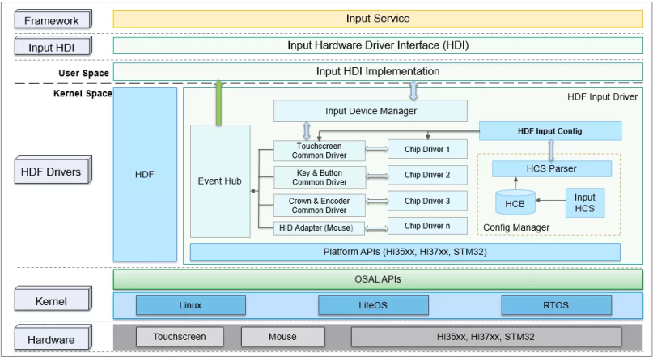

INPUT 驱动模型核心部分由设备管理层、公共驱动层、器件驱动层组成。 

（1）设备管理层：为各类输入设备驱动提供input设备的注册、注销接口，同时统一管理 input 设备列表；

（2）平台驱动层：指各类input设备的公共抽象驱动（例如触摸屏的公共驱动），负责对板级硬件进行初始化、硬件中断处理、向manager注册input设备等；

（3）器件驱动层：指各器件厂家的差异化驱动，通过适配平台驱动预留的差异化接口，实现器件驱动开发量最小化。

#### HDI接口层框架图

INPUT驱动提供给系统服务Input Service可直接调用的驱动能力接口，按照属性分类三类：input设备管理模块、input数据上报模块、input业务控制模块，HDI接口主要包括如下三大类：

- input设备管理模块：管理输入设备，包括输入设备的打开、关闭、设备列表信息获取等；
- input数据上报模块：负责输入事件的上报，包括注册、注销数据上报回调函数等；
- input业务控制模块：提供input设备的业务控制接口，包括获取器件信息及设备类型、设置电源状态等。


### **HDF驱动适配**

#### **HCS配置**

配置设备描述信息，在device_info.hcs中添加device_touch_chip：

```
 input :: host {
            hostName = "input_host";
            priority = 100;
            device_input_manager :: device {   // Input管理层设备描述信息
                device0 :: deviceNode {
                    policy = 2;
                    priority = 100;
                    preload = 0;
                    permission = 0660;
                    moduleName = "HDF_INPUT_MANAGER";
                    serviceName = "hdf_input_host";
                    deviceMatchAttr = "";
                }
            }
            device_hdf_touch :: device {      // Input公共驱动层设备描述信息
                device0 :: deviceNode {
                    policy = 2;
                    priority = 120;
                    preload = 0;
                    permission = 0660;
                    moduleName = "HDF_TOUCH";
                    serviceName = "hdf_input_event1";
                    deviceMatchAttr = "touch_device1";
                }
            }
            device_touch_chip :: device {     // Input器件驱动层信息
                device0 :: deviceNode {
                    policy = 0;
                    priority = 130;
                    preload = 0;
                    permission = 0660;
                    moduleName = "HDF_TOUCH_GT911";
                    serviceName = "hdf_touch_gt911_service";
                    deviceMatchAttr = "zsj_gt911_5p5";
                }
            }
            device_hdf_hid :: device {
                device0 :: deviceNode {
                    policy = 2;
                    priority = 200;
                    preload = 0;
                    permission = 0660;
                    moduleName = "HDF_HID";
                }
            }
        }
```

配置Touch器件信息，在input_config.hcs中添加器件的特性：

```
 chipConfig {
                    template touchChip {
                        match_attr = "";
                        chipName = "gt911";
                        vendorName = "zsj";
                        chipInfo = "AAAA11222";  
                        busType = 0;
                        deviceAddr = 0x5D;                       
                        irqFlag = 2;
                        maxSpeed = 400;
                        chipVersion = 0; //parse Coord TypeA
                        powerSequence {
                            /* [type, status, dir , delay]
                                <type> 0:none 1:vcc-1.8v 2:vci-3.3v 3:reset 4:int
                                <status> 0:off or low  1:on or high  2:no ops
                                <dir> 0:input  1:output  2:no ops
                                <delay> meanings delay xms, 20: delay 20ms
                             */
                            powerOnSeq = [4, 0, 1, 5,
                                         3, 0, 1, 10,
                                         3, 1, 1, 60,
                                         4, 2, 0, 50];
                            suspendSeq = [3, 0, 2, 10];
                            resumeSeq = [3, 1, 2, 10];
                            powerOffSeq = [3, 0, 2, 10,
                                           1, 0, 2, 20];
                        }
                    }

                    chip0 :: touchChip {
                        match_attr = "zsj_gt911_5p5";
                        chipInfo = "ZIDN45100";  
                        chipVersion = 0; 
                    }     
                }
```

#### 适配文件

Touch驱动适配涉及的文件及目录：

1、 编辑 Makefile 文件：./drivers/adapter/khdf/linux/model/input/Makefile

2、 公共配置文件：./vendor/kaihong/khdvk_3566b/hdf_config/khdf/device_info/device_info.hcs

3、 私有配置文件：./vendor/kaihong/khdvk_3566b/hdf_config/khdf/input/input_config.hcs

4、 驱动：drivers\framework\model\input\driver\touchscreen

HDF驱动模型高度抽象集成，TP驱动的适配主要是器件驱动层的适配，首先需要明确TP所需要的软硬件资源。

TP模组需要主机上的如下硬件资源：

1.中断引脚

2.Reset引脚

3.使用的哪一组i2c，从设备的地址是什么

4.TP的初始化固件（通常由IC厂商提供）

5.触摸屏的分辨率

TP模组需要依赖主机上的如下软件资源：

1.Hdf gpio子系统 用于设置gpio pin脚以及一些中断资源

2.Hdf i2c 子系统 用于进行i2c通信

3.Input模型

器件差异化接口适配，示例代码路径：

```
./drivers/framework/model/input/driver/touchscreen/Touch_gdi_gt911.c

static struct TouchChipOps g_gt911ChipOps = {     // 器件IC接口
    .Init = ChipInit,                             // 初始化
    .Detect = ChipDetect,                         // 器件检测
    .Resume = ChipResume,                         // 唤醒
    .Suspend = ChipSuspend,                       // 休眠
    .DataHandle = ChipDataHandle,                 // 器件数据读取
    .UpdateFirmware = UpdateFirmware,             // 固件升级
    .SetAbility = SetAbility,                     // 配置
};
```

器件驱动初始化及HDF注册，示例代码路径：

```
./drivers/framework/model/input/driver/touchscreen/touch_jdi_gt911.c

static int32_t HdfGoodixChipInit(struct HdfDeviceObject *device)
{
    ...
    /* 器件配置结构体内存申请、配置信息解析及挂载 */
    chipCfg = ChipConfigInstance(device);
    ...
    /* 器件实例化 */
    chipDev = ChipDeviceInstance();
    ...
    /* 器件信息挂载及器件私有操作挂载 */
    chipDev->chipCfg = chipCfg;
    chipDev->ops = &g_gt911ChipOps;
    ...
    /* 注册器件驱动至平台驱动 */
    RegisterChipDevice(chipDev);
    ...
}

struct HdfDriverEntry g_touchGoodixChipEntry = {
    .moduleVersion = 1,
    .moduleName = "HDF_TOUCH_GT911",
    .Init = HdfGoodixChipInit,          // 器件驱动初始化函数
    .Release = HdfGoodixChipRelease,
};
HDF_INIT(g_touchGoodixChipEntry);       // 注册器件驱动至HDF框架
```

#### 代码分布

```c
/drivers/peripheral/input
/drivers/framework/model/input
```

## OpenHarmony Camera HDF驱动框架概述

OpenHarmony Camera驱动模型结构

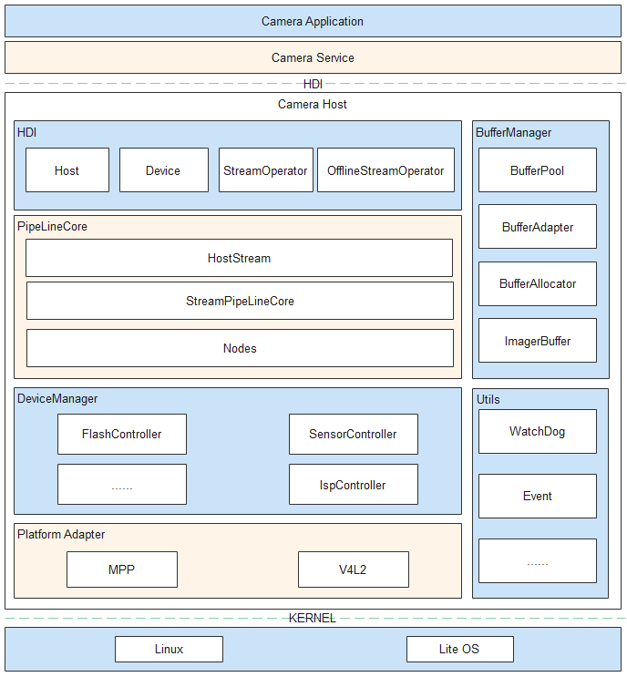

- HDI Implementation：对上实现HDI接口，向下调用框架层的接口，完成HDI接口任务的转发。
- Buffer Manager：屏蔽不同内存管理的差异，为子系统提供统一的操作接口，同时提供buffer轮转的功能。
- Pipeline Core：解析HCS配置完成pipeline的搭建，调度pipeline中的各个node完成流的处理
- Device Manager：通过调用底层硬件适配层接口，实现查询控制底层设备、枚举监听底层设备的功能
- Platform Adaption：屏蔽硬件差异，为Device Manager提供统一的操作底层硬件的能力

### CameraService 进程

CameraService源码目录为：foundation/multimedia/camera_standard，camera app通过camera service与hal层进行交互

    ├── bundle.json
    ├── figures
    ├── frameworks                            camera frameworks部分，支持js和native转换
    │   ├── js
    │   └── native
    ├── hisysevent.yaml
    ├── interfaces                            CameraService接口
    │   ├── inner_api
    │   └── kits
    ├── LICENSE
    ├── OAT.xml
    ├── README.md
    ├── README_zh.md
    ├── sa_profile                            CameraService进程加载配置文件
    │   ├── 3008.xml
    │   └── BUILD.gn
    └── services                            CameraService启动相关
        ├── camera_service
        └── etc

CameraService启动入口在foundation/multimedia/camera_standard/services/etc/camera_service.cfg进行启动配置

    "services" : [{
            "name" : "camera_service",
            "path" : ["/system/bin/sa_main", "/system/profile/camera_service.xml"],
            "uid" : "cameraserver",
            "gid" : ["system", "shell"],
            "secon" : "u:r:camera_service:s0"
        }
    ]

### Camera驱动框架介绍

###Camera驱动整体架构

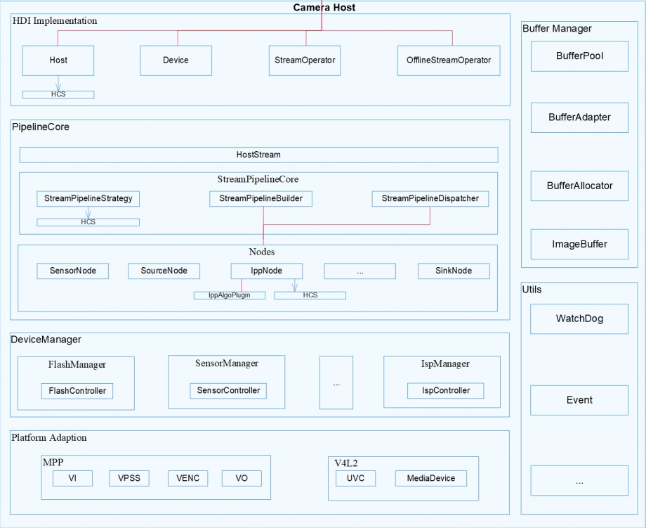

#### camera驱动源码分布

Camera 驱动框架所在的仓为：drivers_peripheral，源码目录为：“drivers/peripheral/camera”。

    ├── bundle.json
    ├── figures
    │   ├── Camera模块驱动模型.png
    │   └── logic-view-of-modules-related-to-this-repository_zh.png
    ├── hal
    │   ├── adapter                    #平台适配层，适配平台
    │   ├── buffer_manager
    │   ├── BUILD.gn                    #Camera驱动框架构建入口
    │   ├── camera.gni                #定义组件所使用的全局变量
    │   ├── device_manager
    │   ├── hdi_impl
    │   ├── include
    │   ├── init                        #demo sample
    │   ├── pipeline_core
    │   ├── test                        #测试代码
    │   └── utils
    ├── hal_c                        #为海思平台提供专用C接口
    │   ├── BUILD.gn
    │   ├── camera.gni
    │   ├── hdi_cif
    │   └── include
    ├── interfaces                    #HDI接口
    │   ├── hdi_ipc
    │   ├── hdi_passthrough
    │   ├── include
    │   └── metadata
    └── README_zh.md

#### Camera Host HDF驱动

###配置文件

Camera Host HDF配置相关在“vendor/kaihong/khdvk_3566b/hdf_config/uhdf/device_info.hcs”

        hdi_server :: host {
            hostName = "camera_host";
            priority = 50;
            caps = ["DAC_OVERRIDE", "DAC_READ_SEARCH"];
            camera_device :: device {
                 device0 :: deviceNode {
                     policy = 2;
                     priority = 100;
                     moduleName = "libcamera_hdi_impl.z.so";
                     serviceName = "camera_service";
                 }
             }
            ...
        }    

其中主要参数说明如下：

- hostName = "camera_host"：camera host节点，该节点为一个独立进程，如果需要独立进程，新增属于自己的host节点
- policy = 2：服务发布策略，Camera使用HDI服务，需设置为2
- moduleName：camera host驱动实现库名
- serviceName：服务名称，请保持全局唯一性，后面HDF Manager会根据这个名称拉起camera hdf

###camera host服务启动
camera host 服务由hdf_devhost启动，配置文件存放于vendor/etc/init/hdf_devhost.cfg

        {
            "name" : "camera_host",
            "path" : ["/vendor/bin/hdf_devhost", "8", "camera_host"],
            "uid" : "camera_host",
            "gid" : ["camera_host"],
            "caps" : ["DAC_OVERRIDE", "DAC_READ_SEARCH"],
            "secon" : "u:r:camera_host:s0"
        }

###Camera host驱动实现
代码路径：drivers/peripheral/camera/interfaces/hdi_ipc/server/src/camera_host_driver.cpp

驱动入口结构体，后面将该结构体注册进HDF框架中

    struct HdfDriverEntry g_cameraHostDriverEntry = {
        .moduleVersion = 1,
        .moduleName = "camera_service",
        .Bind = HdfCameraHostDriverBind,
        .Init = HdfCameraHostDriverInit,
        .Release = HdfCameraHostDriverRelease,
    };

消息发布服务

    static int32_t CameraServiceDispatch(struct HdfDeviceIoClient *client, int cmdId,
        struct HdfSBuf *data, struct HdfSBuf *reply)
    {
        HdfCameraService *hdfCameraService = CONTAINER_OF(client->device->service, HdfCameraService, ioservice);
        return CameraHostServiceOnRemoteRequest(hdfCameraService->instance, cmdId, data, reply);
    }

参数说明：

    client：HdfDeviceIoClient设备句柄
    cmdId：请求消息命令字
    data：其他服务或者IO请求数据
    reply：存储返回消息内容数据

绑定服务：初始化设备服务对象和资源对象

    int HdfCameraHostDriverBind(HdfDeviceObject *deviceObject)
    {
        ...
        hdfCameraService->ioservice.Dispatch = CameraServiceDispatch;
        hdfCameraService->ioservice.Open = nullptr;
        hdfCameraService->ioservice.Release = nullptr;
        hdfCameraService->instance = CameraHostStubInstance();
    
        deviceObject->service = &hdfCameraService->ioservice;
        return HDF_SUCCESS;
    }

相关说明：

    hdfCameraService->ioservice.Dispatch：注册消息分发服务接口
    hdfCameraService->instance：创建camerahost实例

驱动初始化函数： 探测并初始化驱动程序

    int HdfCameraHostDriverInit(struct HdfDeviceObject *deviceObject)
    {
        return HDF_SUCCESS;
    }

驱动资源释放函数 ： 如已经绑定的设备服务对象

    void HdfCameraHostDriverRelease(HdfDeviceObject *deviceObject)
    {
        if (deviceObject == nullptr || deviceObject->service == nullptr) {
            HDF_LOGE("%{public}s deviceObject or deviceObject->service  is NULL!", __FUNCTION__);
            return;
        }
        HdfCameraService *hdfCameraService = CONTAINER_OF(deviceObject->service, HdfCameraService, ioservice);
        if (hdfCameraService == nullptr) {
            HDF_LOGE("%{public}s hdfCameraService is NULL!", __FUNCTION__);
            return;
        }
        OsalMemFree(hdfCameraService);
    }

设备创建不成功，关闭服务，释放相关资源

#### DeviceManager

创建SensorManager、FlashManager、ISPManager管理相应的设备。


####SensorManager
sensor Manager结构如下

    class SensorManager : public IManager {
    public:
        SensorManager();
        explicit SensorManager(ManagerId managerId);
        virtual ~SensorManager();
        RetCode CreateController(ControllerId controllerId, std::string hardwareName);
        RetCode DestroyController(ControllerId controllerId, std::string hardwareName);
        std::shared_ptr<IController> GetController(ControllerId controllerId, std::string hardwareName);
    
        void Configure(std::shared_ptr<CameraMetadata> meta);
        RetCode Start(std::string hardwareName, int buffCont, DeviceFormat& format);
        RetCode Stop(std::string hardwareName);
        RetCode PowerUp(std::string hardwareName);
        RetCode PowerDown(std::string hardwareName);
        std::shared_ptr<ISensor> GetSensor(std::string sensorName);
    
        RetCode SendFrameBuffer(std::shared_ptr<FrameSpec> buffer, std::string hardwareName);
        void SetAbilityMetaDataTag(std::vector<int32_t> abilityMetaDataTag, std::string hardwareName);
        void SetNodeCallBack(const NodeBufferCb cb, std::string hardwareName);
        void SetMetaDataCallBack(const MetaDataCb cb, std::string hardwareName);
    
    private:
        bool CheckCameraIdList(std::string hardwareName);
        std::vector<std::shared_ptr<SensorController>> sensorList_;
    };
    } 

PowerUp为上电接口，OpenCamera时调用此接口进行设备上电操作

PowerDown为下电接口，CloseCamera时调用此接口进行设备下电操作

Configures为Metadata下发接口，如需设置metadata参数到硬件设备，可实现此接口进行解析及下发

Start为硬件模块使能接口，pipeline中的各个node进行使能的时候，会去调用，可根据需要定义实现，比如sensor的起流操作就可放在此处进行实现，Stop和Start为相反操作，可实现停流操作

SendFrameBuffer为每一帧buffer下发接口，所有和驱动进行buffer交互的操作，都是通过此接口进行的

SetNodeCallBack为pipeline，通过此接口将buffer回调函数设置到devicemanager

SetMetaDataCallBack为metadata回调接口，通过此接口将从底层获取的metadata数据上报给上层

BufferCallback上传每一帧已填充数据buffer的接口，通过此接口将buffer上报给pipeline

SetAbilityMetaDataTag设置需要从底层获取哪些类型的metadata数据，因为框架支持单独获取某一类型或多类型的硬件设备信息，所以可以通过此接口，获取想要的metadata数据

Camera Sensor Controller结构如下：

    class SensorController : public IController {
    public:
        SensorController();
        explicit SensorController(std::string hardwareName);
        virtual ~SensorController();
        RetCode Init();
        RetCode PowerUp();
        RetCode PowerDown();
        RetCode Configure(std::shared_ptr<CameraMetadata> meta);
        RetCode Start(int buffCont, DeviceFormat& format);
        RetCode Stop();
        ...
        void SetMetaDataCallBack(MetaDataCb cb) override;
        void BufferCallback(std::shared_ptr<FrameSpec> buffer);
    
        void SetAbilityMetaDataTag(std::vector<int32_t> abilityMetaDataTag);
        RetCode GetAbilityMetaData(std::shared_ptr<CameraMetadata> meta);
        RetCode Flush(int32_t streamId);
        ...
    
    };

PowerUp下发命令给v4l2 dev去操作实际设备进行上电操作
PowerDown下发命令给v4l2 dev去操作实际设备进行下电操作
同理其他操作参考SensorManager.
####FlashManager
Flash Manger结构如下：

    class FlashManager : public IManager {
    public:
        FlashManager();
        explicit FlashManager(ManagerId managerId);
        virtual ~FlashManager();
        RetCode CreateController(ControllerId controllerId, std::string hardwareName);
        std::shared_ptr<IController> GetController(ControllerId controllerId, std::string hardwareName);
        RetCode PowerUp(std::string hardwareName);
        RetCode PowerDown(std::string hardwareName);
        void Configure(std::shared_ptr<CameraMetadata> meta);
        void SetAbilityMetaDataTag(std::vector<int32_t> abilityMetaDataTag, std::string hardwareName)
        {
            (void)abilityMetaDataTag;
            (void)hardwareName;
            return;
        }
        RetCode SetFlashlight(FlashMode flashMode, bool enable, std::string hardwareName);
    private:
        bool CheckCameraIdList(std::string hardwareName);
        std::vector<std::shared_ptr<FlashController>> flashList_;
    }

Flash controller结构如下：

    class FlashController : public IController {
    public:
        FlashController();
        explicit FlashController(std::string hardwareName);
        virtual ~FlashController();
        RetCode Init();
        RetCode PowerUp();
        RetCode PowerDown();
        RetCode Configure(std::shared_ptr<CameraMetadata> meta)
        {
            (void)meta;
            return RC_OK;
        }
        RetCode SetFlashlight(FlashMode flashMode, bool enable);
        void SetAbilityMetaDataTag(std::vector<int32_t> abilityMetaDataTag);
        RetCode GetAbilityMetaData(std::shared_ptr<CameraMetadata> meta);
    private:
        std::mutex startVolock_;
        bool startVoState_ = false;
    }

####ISPManager
ISP Manager结构如下

    class IspManager : public IManager {
    public:
        IspManager();
        explicit IspManager(ManagerId managerId);
        virtual ~IspManager();
        RetCode CreateController(ControllerId controllerId, std::string hardwareName);
        std::shared_ptr<IController> GetController(ControllerId controllerId, std::string hardwareName);
        void Configure(std::shared_ptr<CameraMetadata> meta);
        RetCode Start(std::string hardwareName);
        RetCode Stop(std::string hardwareName);
        RetCode PowerUp(std::string hardwareName);
        RetCode PowerDown(std::string hardwareName);
        void SetAbilityMetaDataTag(std::vector<int32_t> abilityMetaDataTag, std::string hardwareName)
        {
            (void)abilityMetaDataTag;
            (void)hardwareName;
            return;
        }
    private:
        bool CheckCameraIdList(std::string hardwareName);
        std::vector<std::shared_ptr<IspController>> ispList_;
    };

ISP controller结构如下

    class IspController : public IController {
    public:
        IspController();
        explicit IspController(std::string hardwareName);
        virtual ~IspController();
        RetCode Init();
        RetCode Configure(std::shared_ptr<CameraMetadata> meta);
        RetCode PowerUp();
        RetCode PowerDown();
        RetCode Stop();
        RetCode Start();
        void SetAbilityMetaDataTag(std::vector<int32_t> abilityMetaDataTag)
        {
            (void)abilityMetaDataTag;
            return;
        }
        RetCode GetAbilityMetaData(std::shared_ptr<CameraMetadata> meta)
        {
            (void)meta;
            return RC_OK;
        }
    private:
        std::mutex startIsplock_;
        bool startIspState_ = false;
    }

#### PlatForm Adapter

这部分通过V4l2框架对video设备进行管理，包括对相应设备的打开、启动/关闭数据流、设置/获取图像格式等等


####源代码
V4l2 Adapter 源码位于driver/peripheral/camera/hal/adapter/platform/v4l2/src/driver_adapter
部分关键函数如下：

    class HosV4L2Dev {
    public:
        ...
        RetCode start(const std::string& cameraID);
    
        RetCode stop(const std::string& cameraID);
        RetCode CreatBuffer(const std::string& cameraID, const std::shared_ptr<FrameSpec>& frameSpec);
    
        RetCode StartStream(const std::string& cameraID);
    
        RetCode QueueBuffer(const std::string& cameraID, const std::shared_ptr<FrameSpec>& frameSpec);
    
        RetCode ReleaseBuffers(const std::string& cameraID);
    
        RetCode StopStream(const std::string& cameraID);
    
        RetCode SetCallback(BufCallback cb);
    
        static RetCode Init(std::vector<std::string>& cameraIDs);
    
        static std::map<std::string, std::string> deviceMatch;
    
    private:
        std::shared_ptr<HosV4L2Buffers> myBuffers_ = nullptr;
        std::shared_ptr<HosV4L2Streams> myStreams_ = nullptr;
        std::shared_ptr<HosFileFormat> myFileFormat_ = nullptr;
        std::shared_ptr<HosV4L2Control> myControl_ = nullptr;
        ...
        enum v4l2_memory memoryType_ = V4L2_MEMORY_USERPTR;
        enum v4l2_buf_type bufferType_ = V4L2_BUF_TYPE_PRIVATE;
    };

#### PipeLineCore

这个模块解析HCS配置完成pipeline的搭建，调度pipeline中的各个node完成流的处理
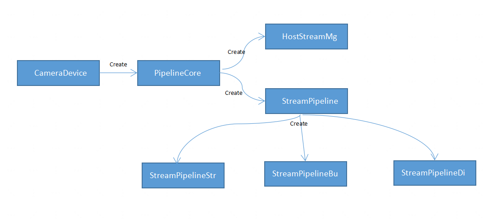

###IPP算法加载
IPP是pipeline 中的一个算法插件模块，由ippnode加载，对流数据进行算法处理，ippnode支持同时多路数据输入，只支持一路数据输出。

vendor/kaihong/khdvk_3566b/hdf_config/uhdf/camera/pipeline_core/ipp_algo_config.hcs为算法插件配置文件，后面有新的算法库需要在这里添加相关内容，添加模板如下：

    root {
        module="sample";
        ipp_algo_config {
            algo1 {
                name = "example";
                description = "example algorithm";
                path = "libcamera_ipp_algo_example.z.so";
                mode = "IPP_ALGO_MODE_NORMAL";
            }
        }
    }

name:算法插件名称 description:描述算法插件的功能 path:算法插件所在路径 mode:算法插件所运行的模式

算法插件可运行的模式由 drivers/peripheral/camera/hal/pipeline_core/ipp/include/ipp_algo.h中的IppAlgoMode提供，可以根据需要进行扩展。

      enum IppAlgoMode {
          IPP_ALGO_MODE_BEGIN,
          IPP_ALGO_MODE_NORMAL = IPP_ALGO_MODE_BEGIN,
          IPP_ALGO_MODE_BEAUTY,
          IPP_ALGO_MODE_HDR,
          IPP_ALGO_MODE_END
      };

算法插件由device/board/kaihong/khdvk_3566b/camera/BUILD.gn文件进行编译，算法插件需实现如下接口（接口由ipp_algo.h指定）供ippnode调用:

    typedef struct IppAlgoFunc {
        int (*Init)(IppAlgoMeta* meta);
        int (*Start)();
        int (*Flush)();
        int (*Process)(IppAlgoBuffer* inBuffer[], int inBufferCount, IppAlgoBuffer* outBuffer, IppAlgoMeta* meta);
        int (*Stop)();
    } IppAlgoFunc;

Init : 算法插件初始化接口，在起流前被ippnode调用，其中IppAlgoMeta定义在ipp_algo.h 中，为ippnode和算法插件提供非图像数据的传递通道，如当前运行的场景，算法处理后输出的人脸坐标等等，可根据实际需求进行扩展

Start：开始接口，起流时被ippnode调用

Flush：刷新数据的接口，停流之前被ippnode调用。此接口被调用时，算法插件需尽可能快地停止处理

Process: 数据处理接口，每帧数据都通过此接口输入至算法插件进行处理。inBuffer是一组输入buffer，inBufferCount是输入buffer的个数，outBuffer是输出buffer，meta是算法处理时产生的非图像数据，IppAlgoBuffer在ipp_algo.h中定义

Stop：停止处理接口，停流时被ippnode调用

下边代码中的id指的是和ippnode对应的port口id，比如inBuffer[0]的id为0，则对应的是ippnode 的第0个输入port口。需要注意的是outBuffer可以为空，此时其中一个输入buffer 被ippnode作为输出buffer传递到下个node，inBuffer至少有一个buffer不为空。输入输出buffer 由pipeline配置决定。 比如在普通预览场景无算法处理且只有一路拍照数据传递到ippnode的情况下，输入buffer只有一个，输出buffer为空，即对于算法插件输入buffer 进行了透传； 比如算法插件进行两路预览图像数据进行合并的场景，第一路buffer需要预览送显示。把第二路图像拷贝到第一路的buffer即可，此时输入buffer有两个，输出buffer为空； 比如在算法插件中进行预览数据格式转换的场景，yuv转换为RGBA，那么只有一个yuv格式的输入buffer的情况下无法完成RGBA格式buffer的输出，此时需要一个新的buffer，那么ippnode的输出port口buffer作为outBuffer传递到算法插件。也即输入buffer只有一个，输出buffer也有一个。

    typedef struct IppAlgoBuffer {
          void* addr;
          unsigned int width;
          unsigned int height;
          unsigned int stride;
          unsigned int size;
          int id;
      } IppAlgoBuffer;

##camera HDF驱动适配
###rk3566rp camera HDF驱动编译选项添加
camera HDF驱动的配置位于drivers/peripheral/camera/hal/camera.gni中，内容如下：

    if (defined(ohos_lite)) {
      import("//build/lite/config/component/lite_component.gni")
      import("//device/board/hisilicon/hispark_taurus/device.gni")
    } else {
      import("//build/ohos.gni")
      import("//vendor/$product_company/$product_name/product.gni")
    }
    
    camera_path = "//drivers/peripheral/camera/hal"
    current_path = "."
    enable_camera_device_utest = false
    
    use_hitrace = false
    if (use_hitrace) {
      defines += [ "HITRACE_LOG_ENABLED" ]
    }
    
    if (defined(ohos_lite)) {
      defines += [ "CAMERA_BUILT_ON_OHOS_LITE" ]
    }

根据编译配置可以找到对应的vendor/kaihong/khdvk_3566b/product.gni，从中获取到实际的文件是device/board/kaihong/khdvk_3566b/device.gni，后面修改入口基于这里

    soc_company = "rockchip"
    soc_name = "rk3566"
    
    import("//device/soc/${soc_company}/${soc_name}/soc.gni")
    
    import("//build/ohos.gni")
    if (!defined(defines)) {
      defines = []
    }
    product_config_path = "//vendor/${product_company}/${device_name}"
    board_camera_path = "//device/board/${product_company}/khdvk_3566b/camera"
    
    camera_product_name_path = "//vendor/${product_company}/${device_name}"
    camera_device_name_path = "//device/board/${product_company}/khdvk_3566b"
    is_support_v4l2 = true
    if (is_support_v4l2) {
      is_support_mpi = false
      defines += [ "SUPPORT_V4L2" ]
      chipset_build_deps = "$camera_device_name_path/camera:chipset_build"
      camera_device_manager_deps = "$camera_device_name_path/camera/device_manager:camera_device_manager"
      camera_pipeline_core_deps = "$camera_device_name_path/camera/pipeline_core:camera_pipeline_core"
    }

最终这里的配置文件里的参数将被drivers/peripheral/camera/hal/BUILD.gn使用。
###HCS配置文件介绍
camera的配置文件位于vendor/kaihong/khdvk_3566b/hdf_config/uhdf/camera/

目录结构如下：

    ├── hdi_impl
    │   ├── camera_host_config.hcs
    └── pipeline_core
        ├── config.hcs
        ├── ipp_algo_config.hcs
        └── params.hcs

Camera所有配置文件使用系统支持的HCS类型的配置文件，HCS类型的配置文件，在编译时，会转成HCB文件，最终烧录到开发板里的配置文件即为HCB格式，代码中通过HCS解析接口解析HCB文件，获取配置文件中的信息。

    ohos_prebuilt_etc("camera_host_config.hcb") {
      deps = [ ":build_camera_host_config" ]
      hcs_outputs = get_target_outputs(":build_camera_host_config")
      source = hcs_outputs[0]
      relative_install_dir = "hdfconfig"
      install_images = [ chipset_base_dir ]
      subsystem_name = "hdf"
      part_name = "camera_device_driver"
    }

camera_host_config.hcs：配置当前camera支持的能力集,物理/逻辑Camera配置、能力配置，此处的物理/逻辑Camera配置，需要在hal内部使用，逻辑Camera及能力配置需要上报给上层，这里需要根据设备实际支持的属性进行相应的修改。
这里的键值对参考文件drivers/peripheral/camera/hal/hdi_impl/include/camera_host/metadata_enum_map.h

       ability_01 :: ability {
            logicCameraId = "lcam001";
            physicsCameraIds = [
                "CAMERA_FIRST",
                "CAMERA_SECOND"
            ];
            metadata {
                aeAvailableAntiBandingModes = [
                    "OHOS_CAMERA_AE_ANTIBANDING_MODE_OFF"
                ];
                aeAvailableModes = ["OHOS_CAMERA_AE_MODE_OFF"];
                availableFpsRange = [30, 30];
                cameraPosition = "OHOS_CAMERA_POSITION_FRONT";
                cameraType = "OHOS_CAMERA_TYPE_WIDE_ANGLE";
                cameraConnectionType ="OHOS_CAMERA_CONNECTION_TYPE_BUILTIN";
                faceDetectMaxNum = "10";
                aeCompensationRange = [0, 0];
                aeCompensationSteps = [0, 0];
                availableAwbModes = [
                    "OHOS_CAMERA_AWB_MODE_OFF"
                ];
                ...
        }

vendor/kaihong/khdvk_3566b/hdf_config/uhdf/camera/pipeline_core/config.hcs为pipeline的连接方式，按场景划分每一路流由哪些Node组成，其连接方式是怎样的。

    normal_preview :: pipeline_spec {
        name = "normal_preview";
        v4l2_source :: node_spec {
            name = "v4l2_source#0";
            status = "new";
            out_port_0 :: port_spec {
                name = "out0";
                peer_port_name = "in0";
                peer_port_node_name = "sink#0";
                direction = 1;
                width = 0;
                height = 0;
                format = 0;
            }
        }
        sink :: node_spec {
            name = "sink#0";
            status = "new";
            stream_type = "preview";
            in_port_0 :: port_spec {
                name = "in0";
                peer_port_name = "out0";
                peer_port_node_name = "v4l2_source#0";
                direction = 0;
            }
        }
    }

上面为preview场景的示例，normal_preview为该场景的名称，source和sink为Node，source为数据数据源端，sink为末端，source为第一个node，node的名称是source#0，status、in/out_port分别为Node状态及输入/输出口的配置。

以in_port_0为例，name = “in0”代表它的输入为“port0”，它的对端为source node的port口out0口，direction为它的源Node和对端Node是否为直连方式。如新添加芯片产品，必须按实际连接方式配置此文件。

新增功能node时需继承NodeBase类，且在cpp文件中注册该node。具体可参考//drivers/peripheral/camera/hal/pipeline_core/nodes/src下已经实现的node。

vendor/kaihong/khdvk_3566b/hdf_config/uhdf/camera/pipeline_core/param.hcs为场景、流类型名及其id定义，pipeline内部是以流id区分流类型的，所以此处需要添加定义。

     root {
        module = "";
        template stream_info {
            id = 0;
            name = "";
        }
        template scene_info {
            id = 0;
            name = "";
        }
        priview :: stream_info {
            id = 0;
            name = "preview";
        }
        video :: stream_info {
            id = 1;
            name = "video";
        }
        snapshot :: stream_info {
            id = 2;
            name = "snapshot";
        }
        normal :: scene_info {
            id = 0;
            name = "normal";
        }
        dual :: scene_info {
            id = 1;
            name = "dual";
        }
    }

##适配过程中遇到的问题
###camera启动时无法出图排查方向

首先排查camera sensor有没有正常的上下电，初始化序列是否正确。
如果上述都正常，需要到HDF层面，看看设备配置是否正确，具体操作如下：
在ohos系统的上电启动过程中，camera host 服务进程调用InitSensors() -->SensorController::Init()-->HosV4L2Dev::Init()->HosFileFormat::V4L2MatchDevice()既ohos在初始化过程中就会去匹配camera实例与linux 驱动系统中的camera硬件，如果匹配则记录存下cameraId与/dev/videox的关系；所以在camera drive中一般需要修改的地方就是camera hardware的name与linux驱动的/dev/videox关系；
代码如下:
cameraIDs向量组内是hdf支持的所以camera 的名称（string）；
./drivers/peripheral/camera/hal/adapter/platform/v4l2/src/device_manager/include/v4l2_device_manager.h定义的cameraId

    std::vector<HardwareConfiguration> hardware = {
        {CAMERA_FIRST, DM_M_SENSOR, DM_C_SENSOR, (std::string) "bm2835 mmal"},
        {CAMERA_FIRST, DM_M_ISP, DM_C_ISP, (std::string) "isp"},
        {CAMERA_FIRST, DM_M_FLASH, DM_C_FLASH, (std::string) "flash"},
        {CAMERA_SECOND, DM_M_SENSOR, DM_C_SENSOR, (std::string) "Imx600"},
        {CAMERA_SECOND, DM_M_ISP, DM_C_ISP, (std::string) "isp"},
        {CAMERA_SECOND, DM_M_FLASH, DM_C_FLASH, (std::string) "flash"}
    };

每个名称应与/dev/videox其中任意一个的capabilities中的driver name是一样的，只有一样的名称才能将hdf的camera name与/dev/videox绑定；

    void HosFileFormat::V4L2MatchDevice(std::vector<std::string>& cameraIDs)
    {
        struct stat st = {};
        char devName[16] = {0};
        std::string name = DEVICENAMEX;
        int fd = 0;
        int rc = 0;
    
        for (auto &it : cameraIDs) {
            for (int i = 0; i < MAXVIDEODEVICE; ++i) {
                if ((sprintf_s(devName, sizeof(devName), "%s%d", name.c_str(), i)) < 0) {
                    CAMERA_LOGE("%s: sprintf devName failed", __func__);
                }
                ...
                rc = V4L2GetCapability(fd, devName, it);
                if (rc == RC_ERROR) {
                    close(fd);
                    continue;
                }
                ...
            }
        }
    }

注意“(cameraId != std::string((char*)cap.driver)”比较cap中的名称是否相同。

    RetCode HosFileFormat::V4L2GetCapability(int fd, const std::string& devName, std::string& cameraId)
    {
        struct v4l2_capability cap = {};
    
        int rc = ioctl(fd, VIDIOC_QUERYCAP, &cap);
        if (rc < 0) {
            return RC_ERROR;
        }
    
        if (!(cap.capabilities & V4L2_CAP_STREAMING)) {
            return RC_ERROR;
        }
    
        if (!((cap.capabilities & V4L2_CAP_VIDEO_CAPTURE_MPLANE) || (cap.capabilities & V4L2_CAP_VIDEO_CAPTURE))) {
            return RC_ERROR;
        }
    
        if (cameraId != std::string((char*)cap.driver)) {
            return RC_ERROR;
        }
    
        std::lock_guard<std::mutex> l(HosV4L2Dev::deviceFdLock_);
        HosV4L2Dev::deviceMatch.insert(std::make_pair(std::string((char*)cap.driver), devName));
        ...
        return RC_OK;
    }

## **BT**

### **HCI接口**

蓝牙整体硬件架构上分为主机（计算机或MCU）和主机控制器（BT蓝牙模组）两部分；通信遵循主机控制器接口（HCI），通常使用串口进行通信，如下所示：


HCI定义了如何交换命令，事件，异步和同步数据包。异步数据包（ACL）用于数据传输，而同步数据包（SCO）用于带有耳机和免提配置文件的语音。

#### **硬件连接**

从RK3566芯片描述中看，该芯片并不没有集成WIFI/蓝牙功能，都需要外接蓝牙芯片才能支持蓝牙功能，这也符合上述逻辑架构。串口使用普通带流控串口即可，一般在原理图中可以看到对应的串口引脚：


可以看到使用的是UART1 M0，在设备树里就要使能对应的串口和pinctrl，同时还可以看到有几个管脚分别做电源和休眠控制。

```
     wireless_bluetooth: wireless-bluetooth {
        compatible = "bluetooth-platdata";
        clocks = <&rk817 1>;
        clock-names = "ext_clock";
        //wifi-bt-power-toggle;
        uart_rts_gpios = <&gpio2 RK_PB5 GPIO_ACTIVE_LOW>;
        pinctrl-names = "default", "rts_gpio";
        pinctrl-0 = <&uart1m0_rtsn &bt_host_wake_gpio &bt_poweren &bt_host_wake_irq>;
        pinctrl-1 = <&uart1_gpios>;
        BT,reset_gpio   = <&gpio0 RK_PC1 GPIO_ACTIVE_HIGH>;
        BT,wake_gpio   = <&gpio0 RK_PB6 GPIO_ACTIVE_HIGH>;
        BT,wake_host_irq = <&gpio0 RK_PB5 GPIO_ACTIVE_HIGH>;
        status = "okay";
    };

    wireless-bluetooth {
        uart1_gpios: uart1-gpios {
          rockchip,pins = <2 RK_PB5 RK_FUNC_GPIO &pcfg_pull_none>;
        };

        bt_host_wake_irq: bt-host-wake-irq {
          rockchip,pins = <0 RK_PB5 RK_FUNC_GPIO &pcfg_pull_down>;
        };
        bt_host_wake_gpio: bt-host-wake-gpio {
          rockchip,pins = <0 RK_PB6 RK_FUNC_GPIO &pcfg_pull_down>;
        };
        bt_poweren: bt-poweren {
          rockchip,pins = <0 RK_PC1 RK_FUNC_GPIO &pcfg_pull_down>;
        };
      };


    &uart1 {
      status = "okay";
      pinctrl-names = "default";
      pinctrl-0 = <&uart1m0_xfer &uart1m0_ctsn>;
    };
```

### **蓝牙VENDORLIB适配**

#### **vendorlib是什么**

vendorlib部署在主机侧，可以认为是主机侧对蓝牙芯片驱动层，屏蔽不同蓝牙芯片的技术细节。从代码层面解读，其主要功能有两个：

1、为协议栈提供蓝牙芯片之间的通道（串口的文件描述符）

2、提供特定芯片的具体控制方法

#### **代码层面解读vendorlib**

bt_vendor_lib.h 路径：

```
foundation/communication/bluetooth/services/bluetooth_standard/hardware/include
```

该文件定义了协议栈和vendor_lib交互接口，分为两组：

1、 vendorlib实现，协议栈调用

```
    typedef struct {
      /**
       \* Set to sizeof(bt_vndor_interface_t)
       */
      size_t size;
      /**
       \* Caller will open the interface and pass in the callback routines
       \* to the implemenation of this interface.
       */
      int (*init)(const bt_vendor_callbacks_t* p_cb, unsigned char* local_bdaddr);

      /**
       \* Vendor specific operations
       */
      int (*op)(bt_opcode_t opcode, void* param);

      /**
       \* Closes the interface
       */
      void (*close)(void);
    } bt_vendor_interface_t;
```

协议栈启动时的基本流程如下：

1.1、协议栈动态打开libbt_vendor.z.so，并调用init函数，初始化vendorlib

1.2、协议栈调用op函数，分别调用BT_OP_POWER_ON、BT_OP_HCI_CHANNEL_OPEN、BT_OP_INIT三个opcode；原则上BT_OP_INIT成功后说明芯片初始化完成。

2、协议栈实现，vendorlib调用（回调函数）

```
    typedef struct {
      /**
      \* set to sizeof(bt_vendor_callbacks_t)
      */
      size_t size;

      /* notifies caller result of init request */
      init_callback init_cb;

      /* buffer allocation request */
      malloc_callback alloc;

      /* buffer free request */
      free_callback dealloc;

      /* hci command packet transmit request */
      cmd_xmit_callback xmit_cb;
    } bt_vendor_callbacks_t;
```

init_cb在BT_OP_INIT完成后调用

alloc/dealloc用于发送HCI消息时申请/释放消息控件

xmit_cb发送HCI Commands

##### vendor_lib实现的几个重要函数

1、 init函数

```
   static int init(const bt_vendor_callbacks_t *p_cb, unsigned char *local_bdaddr)
   {
      /* * ... */
     userial_vendor_init();
     upio_init();

   vnd_load_conf(VENDOR_LIB_CONF_FILE);

     /* store reference to user callbacks */
     bt_vendor_cbacks = (bt_vendor_callbacks_t *)p_cb;
       /* This is handed over from the stack */
     return memcpy_s(vnd_local_bd_addr, BD_ADDR_LEN, local_bdaddr, BD_ADDR_LEN);
   }
```

vendorlib被调用的第一个函数，vendorlib保存好协议栈的callback和mac地址即可。

2、 BT_OP_POWER_ON对应处理

观名知意，这个操作理论上需要拉高电源管脚电平；该函数中使用rfill设备来处理，并没有直接调用驱动拉高电平

```
   int upio_set_bluetooth_power(int on)
   {
     int sz;
     int fd = -1;
     int ret = -1;
     char buffer = '0';

     switch (on) {
       case UPIO_BT_POWER_OFF:
         buffer = '0';
         break;

       case UPIO_BT_POWER_ON:
         buffer = '1';
         break;
       default:
         return 0;
     }

     /* check if we have rfkill interface */
     if (is_rfkill_disabled()) {
       return 0;
     }

     if (rfkill_id == -1) {
       if (init_rfkill()) {
         return ret;
       }
     }

     fd = open(rfkill_state_path, O_WRONLY);
     if (fd < 0) {
       return ret;
     }

     sz = write(fd, &buffer, 1);
     /* ... */
     return ret;
   }
```

3、BT_OP_HCI_CHANNEL_OPEN对应处理

```
   case BT_OP_HCI_CHANNEL_OPEN: { // BT_VND_OP_USERIAL_OPEN
         int(*fd_array)[] = (int(*)[])param;
         int fd, idx;
         fd = userial_vendor_open((tUSERIAL_CFG *)&userial_init_cfg);
         if (fd != -1) {
           for (idx = 0; idx < HCI_MAX_CHANNEL; idx++)
             (*fd_array)[idx] = fd;
           retval = 1;
       }
       /* retval contains numbers of open fd of HCI channels */
       break;
```

userial_vendor_open函数打开串口设备（UART）得到文件描述符(fd)，通过op的参数param返回该fd

该串口设备在系统中的名字在vendor下的bluetooth相关目录中的bt_vendor_brcm.h文件定义了，本次开发板上设备为/dev/ttyS1

4、BT_OP_INIT对应处理

该操作码要求对蓝牙芯片进行初始化，具体要进行的处理和蓝牙芯片强相关。以本次调测的AP6xxx芯片为例，初始化过程中主要是下发蓝牙固件。

初始化结束后，必须调用init_cb回调函数（参见bt_vendor_callbacks_t）通知协议栈初始化结果，否则会阻塞协议栈线程导致蓝牙相关功能无法正常使用。协议栈的具体处理如下：

协议栈调用BT_OP_INIT后会等待信号量，该信号量由init_cb函数置位

```
   static int HciInitHal()
   {
     int result = BT_NO_ERROR;

     g_waitHdiInit = SemaphoreCreate(0);
     int ret = g_hdiLib->hdiInit(&g_hdiCallbacks);
     if (ret == SUCCESS) {
       SemaphoreWait(g_waitHdiInit);
     }
   }
```

#### **vendorlib移植问题**

1、 vendorlib的so命名

vendorlib必须是libbt_vendor.z.so；因为协议栈打开动态链接库就是这个名字

2、 固件问题

开发时一定要关注芯片固件，有些蓝牙芯片可能无需升级固件，有些则必须升级固件, 不同型号的蓝牙对应固件也不一样；本次AP6xxx适配过程中最开始没有下发固件，导致蓝牙接收信号很差。固件下发时需要注意如下两点：

2.1、对于AP6xxx芯片，因为蓝牙芯片内并没有类似flash存储，要求芯片上下电后必须重新下发，固件要通过BUILD.gn把固件标记为prebuilt_etc

```
   ohos_prebuilt_etc("BCM43430A1.hcd") {
    source = "//vendor/kaihong/RK3566-xx/bluetooth/BCM43430A1.hcd"
    install_images = [ vendor_base_dir ]
    relative_install_dir = "firmware"
    part_name = "kaihong_products"
    install_enable = true
   }
```

然后在device/kaihong/build中把固件打包在镜像中

```
 "//vendor/kaihong/RK3566-xx/bluetooth:libbt_vendor",
 "//vendor/kaihong/RK3566-xx/bluetooth:BCM43430A1.hcd",
```

2.2、按照芯片本身的要求处理，最好能找到厂商的参考代码；以Broadcom系列芯片为例，其固件下发过程比较复杂，通过一个状态机驱动；共如下9个状态

```
   / Hardware Configuration State */
   enum {
    HW_CFG_START = 1,
    HW_CFG_SET_UART_CLOCK,
    HW_CFG_SET_UART_BAUD_1,
    HW_CFG_READ_LOCAL_NAME,
    HW_CFG_DL_MINIDRIVER,
    HW_CFG_DL_FW_PATCH,
    HW_CFG_SET_UART_BAUD_2,
    HW_CFG_SET_BD_ADDR,
    HW_CFG_READ_BD_ADDR
   };
```

在收到BT_OP_INIT后初始化状态机，然后发送HCI_REST命令，切换状态为HW_CFG_START；

```
   void hw_config_start(void)
   {
     HC_BT_HDR *p_buf = NULL;
     uint8_t *p;
     hw_cfg_cb.state = 0;
     hw_cfg_cb.fw_fd = -1;
     hw_cfg_cb.f_set_baud_2 = FALSE;

     if (bt_vendor_cbacks) {
       p_buf = (HC_BT_HDR *)bt_vendor_cbacks->alloc(BT_HC_HDR_SIZE +
                              HCI_CMD_PREAMBLE_SIZE);
     }

     if (p_buf) {
       p_buf->event = MSG_STACK_TO_HC_HCI_CMD;
       p_buf->offset = 0;
       p_buf->layer_specific = 0;
       p_buf->len = HCI_CMD_PREAMBLE_SIZE;

       p = (uint8_t *)(p_buf + 1);
       UINT16_TO_STREAM(p, HCI_RESET);
       *p = 0;

       hw_cfg_cb.state = HW_CFG_START;
       bt_vendor_cbacks->xmit_cb(HCI_RESET, p_buf);
     } else {
       if (bt_vendor_cbacks) {
         HILOGE("vendor lib fw conf aborted [no buffer]");
         bt_vendor_cbacks->init_cb(BTC_OP_RESULT_FAIL);
       }
     }
   }
```

收到芯片返回的HCI_RESET完成事件后，继续切换到下一个状态机并发送下一个COMMAND，一直到状态机完成固件下发。

详细实现请参见hw_config_cback函数。

3、 关注系统间接口差异

不同系统的接口可能有一些细微差异，需要重点关注；对比安卓和OHOS的接口，vendorlib调用xmit_cb发送HCI命令的函数定义略有差异

安卓：

```
   /* define callback of the cmd_xmit_cb
    *

   The callback function which HCI lib will call with the return of command

   complete packet. Vendor lib is responsible for releasing the buffer passed

   in at the p_mem parameter by calling dealloc callout function.
   */
   typedef void (*tINT_CMD_CBACK)(void* p_mem);
   typedef uint8_t (*cmd_xmit_cb)(uint16_t opcode, void* p_buf, tINT_CMD_CBACK p_cback);
   OHOS：
   /**

   hci command packet transmit callback

   Vendor lib calls cmd_xmit_cb function in order to send a HCI Command

   packet to BT Controller. 
   *

   The opcode parameter gives the HCI OpCode (combination of OGF and OCF) of

   HCI Command packet. For example, opcode = 0x0c03 for the HCI_RESET command

   packet. */

   typedef uint8_t (*cmd_xmit_callback)(uint16_t opcode, void* p_buf);
```

也就是说vendorlib中发送命令后，安卓会直接调用callback通知芯片返回的消息，OHOS则是通过BT_OP_EVENT_CALLBACK操作码（参见bt_opcode_t定义）通知芯片返回的消息；vendorlib需要解析报文中的消息码确认芯片是处理的哪个消息，然后调用对应的处理函数。

```
   void hw_process_event(HC_BT_HDR *p_buf)
   {
     uint16_t opcode;
     uint8_t *p = (uint8_t *)(p_buf + 1) + HCI_EVT_CMD_CMPL_OPCODE;
     STREAM_TO_UINT16(opcode, p);
     switch (opcode) {
     case HCI_VSC_WRITE_BD_ADDR:
     \#if (USE_CONTROLLER_BDADDR == TRUE)
       case HCI_READ_LOCAL_BDADDR:
     \#endif
       case HCI_READ_LOCAL_NAME:
       case HCI_VSC_DOWNLOAD_MINIDRV:
       case HCI_VSC_WRITE_FIRMWARE:
       case HCI_VSC_LAUNCH_RAM:
       case HCI_RESET:
       case HCI_VSC_WRITE_UART_CLOCK_SETTING:
       case HCI_VSC_UPDATE_BAUDRATE:
         hw_config_cback(p_buf);
         break;
```

另外，OHOS返回的是发送消息的字节数，<=0为发送失败，和安卓接口的返回值也不同

4、 btvendor日志

在vendor下的bluetooth/include相关目录里的Log.h中定义log文件的保存路径，我们代码里生成文件为/data/btvendor.log。也可以通过wireshark或其它报文分析工具可以看到Host和Controller之间的交互流程，有助于问题分析。

## WIFI

#### **整改思路及实现流程**

##### 整改思路

主要参考https://mp.weixin.qq.com/s/iiE97pqPtzWIZadcjrQtsw 《OpenHarmony HDF WLAN驱动分析与使用》这篇文章，熟悉HDF WLAN的框架以及需要实现的主要接口，包括HDF驱动初始化接口、WLAN控制侧接口集、AP模式接口集、STA模式接口集、网络侧接口集、事件上报接口的实现。接下来熟悉HCS文件的格式以及"HDF WIFI”核心驱动框架的代码启动初始化过程，参考hi3881的代码进行改造。

##### **HDF WiFi框架总体框架图**

WLAN驱动架构组成：

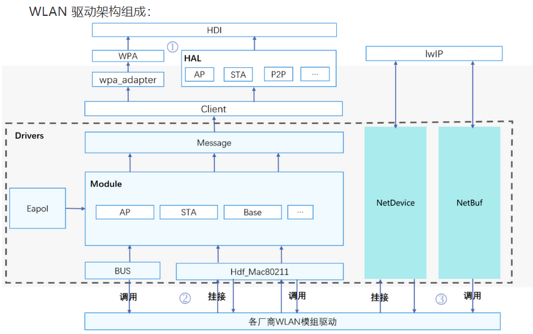

#### ap6256驱动代码流程分析

##### **驱动模块初始化流程分析**

 

Ap6256 是一款SDIO设备WiFi模组驱动，使用标准Linux的SDIO设备驱动。内核模块初始化入口module_init()调用dhd_wifi_platform_load_sdio()函数进行初始化工作，这里调用wifi_platform_set_power()进行GPIO上电，调用dhd_wlan_set_carddetect()进行探测SDIO设备卡，最后调用sdio_register_driver(&bcmsdh_sdmmc_driver)；进行SDIO设备驱动的注册，SDIO总线已经检测到WiFi模块设备，根据设备号和厂商号与该设备驱动匹配, 所以立即回调该驱动的bcmsdh_sdmmc_probe()函数，这里进行WiFi模组芯片的初始化工作，最后创建net_device网络接口wlan0，然后注册到Linux内核协议栈中。

下面对其中比较重要的函数进行举例分析：

(1) dhd_bus_register函数，主要实现sdio设备的注册，通过回调dhd_sdio中的相关函数，对wifi模块进行驱动注册等相关操作。

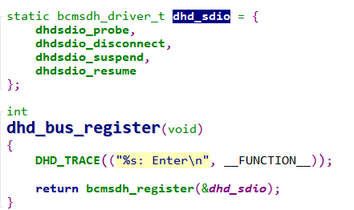 

其中函数bcmsdh_register将静态结构体变量dhd_sdio赋值给静态结构体drvinfo，然后通过函数bcmsdh_register_client_driver调用函数sdio_register_driver向系统注册sdio接口驱动。

 

 

当sdio设备与sdio总线进行匹配后，会回调函数bcmsdh_sdmmc_probe，函数bcmsdh_sdmmc_probe会进一步回调dhd_sdio结构体中的成员函数dhdsdio_probe。

(2) dhdsdio_probe函数，主要实现net_device对象(wlan0)的创建,以及wireless_dev对象创建，并与net_device对象的成员ieee80211_ptr进行关联，给net_device对象的操作方法成员netdev_ops赋值，最后将net_device对象注册到协议栈中。

- 创建net_device网络接口wlan0对象

dhd_allocate_if()会调用alloc_etherdev()创建net_device对象，即wlan0网络接口。wl_cfg80211_attach()会创建wireless_dev对象，并将wireless_dev对象赋值给net_device对象的成员ieee80211_ptr。

- 将wlan0注册到内核协议栈

调用dhd_register_if()函数，这里将net_device_ops操作方法的实例dhd_ops_pri赋值给net_device对象的成员netdev_ops，然后调用register_netdev(net);将net_device对象wlan0网络接口注册到协议栈。

#### 整改代码适配HDF WiFi框架

对于系统WiFi功能的使用，需要实现AP模式、STA模式、P2P三种主流模式，这里使用wpa_supplicant应用程序通过HDF WiFi框架与WiFi驱动进行交互，实现STA模式和P2P模式的功能，使用hostapd应用程序通过HDF WiFi框架与WiFi驱动进行交互，实现AP模式和P2P模式的功能。

Ap6256 WiFi6内核驱动依赖platform能力，主要包括SDIO总线的通讯能力；与用户态通信依赖HDF WiFi框架的能力，在确保上述能力功能正常后，即可开始本次WiFi驱动的HDF适配移植工作。本文档基于已经开源的rk3568开源版代码为基础版本，来进行此次移植。

适配移植ap6256 WiFi驱动涉及到的文件和目录如下：

3.1 WIFI相关的HDF框架编译控制宏

ap6256采用的是sdio总线，涉及到的通用编译控制宏如下：

CONFIG_DRIVERS_HDF_PLATFORM_SDIO=y

CONFIG_DRIVERS_HDF_PLATFORM_MMC=y

CONFIG_DRIVERS_HDF_WIFI=y

CONFIG_DRIVERS_HDF_STORAGE=y

3.2 具体WiFi设备驱动编译控制宏

涉及到wifi设备驱动的编译控制宏位于drivers/adapter/khdf/linux/model/network/wifi/Kconfig中，其中主要涉及到编译控制宏如下：

CONFIG_DRIVERS_HDF_NETDEV_EXT=y

CONFIG_AP6XXX_WIFI6_HDF=y

编译控制选项CONFIG_AP6XXX_WIFI6_HDF，内容如下：

config AP6XXX_WIFI6_HDF

  tristate "support ap6xxx wifi6(80211ax) HDF"

  depends on DRIVERS_HDF_WIFI

​    select CFG80211

​    select MAC80211

​    select DRIVERS_HDF_NETDEV_EXT

  help

   This driver supports wifi6 for ap6xxx HDF chipset.

   This driver uses the kernel's wireless extensions subsystem.

   If you choose to build a module, it'll be called dhd. Say M if unsure.

NOTE：此处为了保证框架侧与社区代码一致，不建议修改，设置CONFIG_AP6XXX_WIFI6_HDF的配置即可。

3.3 修改编译规则Makefile文件，添加ap6256驱动的源码位置

在drivers/adapter/khdf/linux/model/network/wifi/vendor/Makefile文件，添加如下内容：

ifneq ($(CONFIG_AP6XXX_WIFI6_HDF),)

\#RKWIFI_PATH := $(HDF_VENDOR_PREFIX)/device/$(product_company)/$(product_device)/wifi

RKWIFI_PATH := $(HDF_VENDOR_PREFIX)/device/kaihong/rk3568-khdvk/wifi  //修改添加部分

obj-$(CONFIG_AP6XXX_WIFI6_HDF) += $(RKWIFI_PATH)/

endif

ap6256驱动源码就位于源码/device/kaihong/rk3568-khdvk/wifi中，另外再根据ap6256的编译规则，修改wifi中的Makefile。

NOTE：此处也不建议修改，源码就位于device/$(product_company)/$(product_device)/wifi中，但此处不能获取$(product_company)与$(product_device)的值，还需要社区进行完善

###### WiFi驱动源码目录

驱动代码编译规则修改

参考device/kaihong/rk3568-khdvk/wifi/Makefile文件，内容如下：

obj-$(CONFIG_AP6XXX_WIFI6_HDF) += bcmdhd_hdf/

NOTE：可以修改目标规则指向不同的wifi驱动代码。

原生驱动代码存放于：

device/kaihong/rk3568-khdvk/patches/kernel/drivers/net/wireless/rockchip_wlan/rkwifi/bcmdhd/

在原生驱动上修改编译规则Makefile文件

由于驱动中添加了HDF框架代码，其中涉及到头文件位于drivers目录中，需要将相关路径加入编译规则中，主要是修改两点：

(1) 引用drivers/hdf/khdf/model/network/wifi/hdfwifi.mk中规则，在Makefile中添加语句如下：

include drivers/hdf/khdf/model/network/wifi/hdfwifi.mk

(2) 将hdfwifi.mk中涉及到的头文件定义添加到编译规则中，方便编译时引用，添加语句如下：

EXTRA_CFLAGS += $(HDF_FRAMEWORKS_INC) \

​        $(HDF_WIFI_FRAMEWORKS_INC) \

​        $(HDF_WIFI_ADAPTER_INC) \

​        $(HDF_WIFI_VENDOR_INC) \

​        $(SECURE_LIB_INC)

NOTE：如果有其他编译要求，可以修改Makefile中的相关规则

3.4.4 在原生驱动上增加以及修改的HDF驱动代码文件位于：

device/kaihong/rk3568-khdvk/wifi/bcmdhd_hdf/

目录结构：

./device/kaihong/rk3568-khdvk/wifi/bcmdhd_hdf/hdf

├── hdf_bdh_mac80211.c

├── hdf_driver_bdh_register.c

├── hdfinit_bdh.c    

├── hdf_mac80211_ap.c    

├── hdf_mac80211_sta.c           

├── hdf_mac80211_sta.h      

├── hdf_mac80211_sta_event.c      

├── hdf_mac80211_sta_event.h

├── hdf_mac80211_p2p.c

├── hdf_public_ap6256.h

├── net_bdh_adpater.c  

├── net_bdh_adpater.h 

其中hdf_bdh_mac80211.c主要对g_bdh6_baseOps所需函数的填充，hdf_mac80211_ap.c主要对g_bdh6_staOps所需函数进行填充，hdf_mac80211_sta.c主要对g_bdh6_staOps所需函数进行填充，hdf_mac80211_p2p.c主要对g_bdh6_p2pOps所需函数进行填充，在drivers/framework/include/wifi/wifi_mac80211_ops.h里有对wifi基本功能所需api的说明。 

###### 驱动文件编写

HDF WLAN驱动框架由Module、NetDevice、NetBuf、BUS、HAL、Client 和 Message 这七个部分组成。开发者在WiFi驱动HDF适配过程中主要实现以下几部分功能：

适配HDF WLAN框架的驱动模块初始化

代码流程框图如下：

 

HDF代码入口

HDF代码入口位于device/kaihong/rk3568-khdvk/wifi/bcmdhd_hdf/hdf_driver_bdh_register.c

struct HdfDriverEntry g_hdfBdh6ChipEntry = {

  .moduleVersion = 1,

  .Bind = HdfWlanBDH6DriverBind,

  .Init = HdfWlanBDH6ChipDriverInit,

  .Release = HdfWlanBDH6ChipRelease,

  .moduleName = "HDF_WLAN_CHIPS"

};

HDF_INIT(g_hdfBdh6ChipEntry);

3.5.2 HDF驱动的注册

在函数HDFWlanRegBDH6DriverFactory中完成HDF驱动的注册，相关代码如下：

static int32_t HDFWlanRegBDH6DriverFactory(void)

{

  static struct HdfChipDriverFactory BDH6Factory = { 0 };  // WiFi device chip driver

  struct HdfChipDriverManager *driverMgr = NULL;

  driverMgr = HdfWlanGetChipDriverMgr();

  if (driverMgr == NULL) {

​    HDF_LOGE("%s fail: driverMgr is NULL!", __func__);

​    return HDF_FAILURE;

  }

  BDH6Factory.driverName = BDH6_DRIVER_NAME;

  BDH6Factory.GetMaxIFCount = GetBDH6GetMaxIFCount;

  BDH6Factory.InitChip = InitBDH6Chip;

  BDH6Factory.DeinitChip = DeinitBDH6Chip;

  BDH6Factory.Build = BuildBDH6Driver;

  BDH6Factory.Release = ReleaseBDH6Driver;

  BDH6Factory.ReleaseFactory = NULL;

  if (driverMgr->RegChipDriver(&BDH6Factory) != HDF_SUCCESS) {

​    HDF_LOGE("%s fail: driverMgr is NULL!", __func__);

​    return HDF_FAILURE;

  }

  return HDF_SUCCESS;

}

在注册HDF驱动时，需要实现HDF的基本操作，对struct HdfChipDriverFactory结构体进行初始化，struct HdfChipDriverFactory结构体的内容如下：

struct HdfChipDriverFactory {

  const char *driverName;  /**< Driver name */

  int32_t (*InitChip)(struct HdfWlanDevice *device);

  int32_t (*DeinitChip)(struct HdfWlanDevice *device);

  void (*ReleaseFactory)(struct HdfChipDriverFactory *factory);

  struct HdfChipDriver *(*Build)(struct HdfWlanDevice *device, uint8_t ifIndex);

  void (*Release)(struct HdfChipDriver *chipDriver);

  uint8_t (*GetMaxIFCount)(struct HdfChipDriverFactory *factory);

};

相关函数接口说明:

| 函数                   | 功能         |
| -------------------- | ---------- |
| GetBDH6GetMaxIFCount | 无需实现具体操作   |
| InitBDH6Chip         | 芯片初始化      |
| DeinitBDH6Chip       | 芯片去初始化     |
| BuildBDH6Driver      | 实现芯片驱动侧绑定  |
| ReleaseBDH6Driver    | 释放WLAN芯片驱动 |
| ReleaseFactory       | 无需实现       |

3.5.3 芯片驱动初始化

芯片驱动初始化函数以及wifi相关的ap、sta、p2p操作函数的注册都在BuildBDH6Driver函数中实现，主要是实现struct HdfChipDriver结构体的初始化，struct HdfChipDriver结构体如下：

struct HdfChipDriver {

  uint16_t type;              /**< Chip type */

  char name[MAX_WIFI_COMPONENT_NAME_LEN]; /**< Chip name */

  struct HdfMac80211BaseOps *ops;     /**< MAC address for the basic feature */

  struct HdfMac80211STAOps *staOps;    /**< MAC address for the STA feature */

  struct HdfMac80211APOps *apOps;     /**< MAC address for the AP feature */

  struct HdfMac80211P2POps *p2pOps;     /**< MAC address for the P2Pfeature */

  void *priv;               /**< Private data of the chip driver */

  int32_t (*init)(struct HdfChipDriver *chipDriver, NetDevice *netDev);

  int32_t (*deinit)(struct HdfChipDriver *chipDriver, NetDevice *netDev);

};

1）函数BuildBDH6Driver具体实现如下：

static struct HdfChipDriver *BuildBDH6Driver(struct HdfWlanDevice *device, uint8_t ifIndex)

{

  struct HdfChipDriver *specificDriver = NULL;

  if (device == NULL) {

​    HDF_LOGE("%s fail : channel is NULL", __func__);

​    return NULL;

  }

  (void)device;

  (void)ifIndex;

  specificDriver = (struct HdfChipDriver *)OsalMemCalloc(sizeof(struct HdfChipDriver)); //分配结构体地址空间

  if (specificDriver == NULL) {

​    HDF_LOGE("%s fail: OsalMemCalloc fail!", __func__);

​    return NULL;

  }

  if (memset_s(specificDriver, sizeof(struct HdfChipDriver), 0, sizeof(struct HdfChipDriver)) != EOK) {

​    HDF_LOGE("%s fail: memset_s fail!", __func__);

​    OsalMemFree(specificDriver);

​    return NULL;

  }

  if (strcpy_s(specificDriver->name, MAX_WIFI_COMPONENT_NAME_LEN, BDH6_DRIVER_NAME) != EOK) {

​    HDF_LOGE("%s fail : strcpy_s fail", __func__);

​    OsalMemFree(specificDriver);

​    return NULL;

  }

  specificDriver->init = BDH6Init;

  specificDriver->deinit = BDH6Deinit;

  HDF_LOGW("bdh6: call BuildBDH6Driver %p", specificDriver);

  BDH6Mac80211Init(specificDriver); //wifi相关的ap、sta、p2p操作接口初始化赋值

  return specificDriver;

}

2）函数BDH6Mac80211Init实现wifi相关的ap、sta、p2p操作接口赋值到struct HdfChipDriver结构体中，具体实现如下

void BDH6Mac80211Init(struct HdfChipDriver *chipDriver)

{

  HDF_LOGE("%s: start...", __func__);

  if (chipDriver == NULL) {

​    HDF_LOGE("%s: input is NULL", __func__);

​    return;

  }

  chipDriver->ops = &g_bdh6_baseOps;

  chipDriver->staOps = &g_bdh6_staOps;

  chipDriver->apOps = &g_bdh6_apOps;

  chipDriver->p2pOps = &g_bdh6_p2pOps;

}

3.5.4 Wifi芯片驱动初始化

Wifi芯片驱动初始化过程，由函数BDH6Init实现，主要涉及到wlan0网络节点的注册与p2p0网络节点的注册，以及芯片驱动的初始化过程。

整体流程如下：

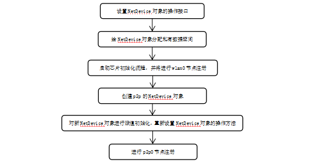

下面对涉及的重要函数代码进行列举：

(1) 设置NetDevice对象的操作接口，函数主要通过全局结构体赋值给NetDevice对象的成员netDeviceIf指针来实现，具体代码如下：

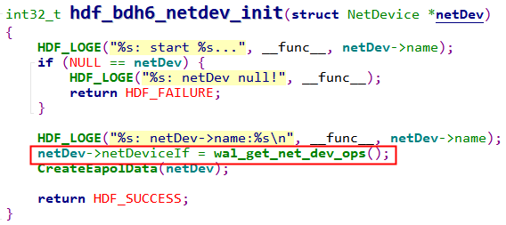 

(2) 给NetDevice对象分配私有数据空间，具体实现如下：


(3) 启动芯片初始化流程，请参考原生驱动的初始化流程，其中需要注意的是，需要进行wlan0的节点注册，代码在原生驱动函数dhd_register_if中进行实现，具体代码如下：

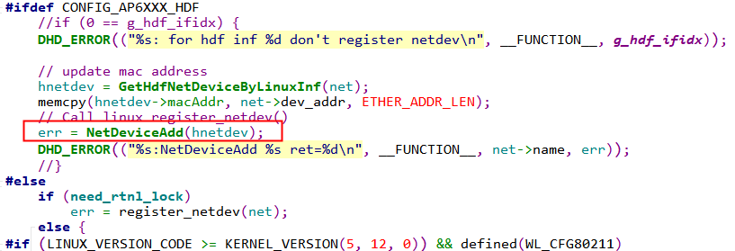 

(4) 创建p2p0的NetDevice对象，具体代码实现如下：


(5) 重新设置p2p0的操作方法，并进行p2p0节点注册，具体代码实现如下：

 

3.5.5 HDF WlAN相关的控制接口

HDF WlAN相关的控制接口主要涉及到HdfMac80211BaseOps、HdfMac80211STAOps、HdfMac80211APOps、HdfMac80211P2POps结构体，通过将以上结构体的全局变量赋值给struct HdfChipDriver结构体的ops、staOps、apOps、p2pOps成员来实现。

1）HDF WLAN Base控制侧接口的实现

代码位于hdf_bdh_mac80211.c

static struct HdfMac80211BaseOps g_bdh6_baseOps = {

  .SetMode = BDH6WalSetMode,

  .AddKey = BDH6WalAddKey,

  .DelKey = BDH6WalDelKey,

  .SetDefaultKey = BDH6WalSetDefaultKey,

  .GetDeviceMacAddr = BDH6WalGetDeviceMacAddr,

  .SetMacAddr = BDH6WalSetMacAddr,

  .SetTxPower = BDH6WalSetTxPower,

  .GetValidFreqsWithBand = BDH6WalGetValidFreqsWithBand,

  .GetHwCapability = BDH6WalGetHwCapability,

.SendAction = BDH6WalSendAction,

  .GetIftype = BDH6WalGetIftype,

};

上述实现的接口供STA、AP、P2P三种模式中所调用。

2）HDF WLAN STA模式接口的实现

STA模式调用流程图如下：

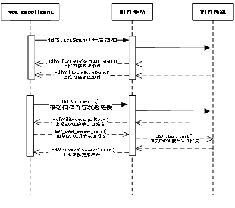

代码位于hdf_mac80211_sta.c

struct HdfMac80211STAOps g_bdh6_staOps = {

  .Connect = HdfConnect,

  .Disconnect = HdfDisconnect,

  .StartScan = HdfStartScan,

  .AbortScan = HdfAbortScan,

  .SetScanningMacAddress = HdfSetScanningMacAddress,

};

3） HDF WLAN AP模式接口的实现

AP模式调用流程图如下：


代码位于hdf_mac80211_ap.c

struct HdfMac80211APOps g_bdh6_apOps = {

  .ConfigAp = WalConfigAp,

  .StartAp = WalStartAp,

  .StopAp = WalStopAp,

  .ConfigBeacon = WalChangeBeacon,

  .DelStation = WalDelStation,

  .SetCountryCode = WalSetCountryCode,

  .GetAssociatedStasCount = WalGetAssociatedStasCount,

  .GetAssociatedStasInfo = WalGetAssociatedStasInfo

};

4）HDF WLAN P2P模式接口的实现

P2P模式调用流程图如下：

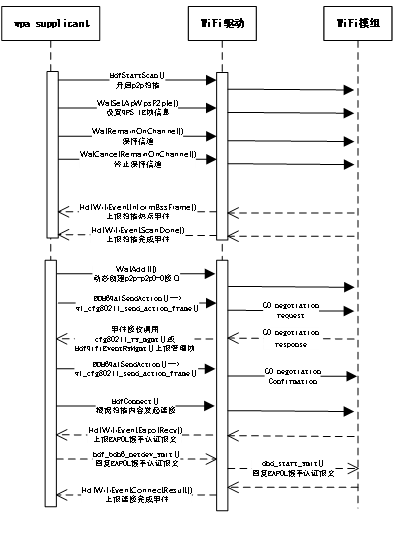

struct HdfMac80211P2POps g_bdh6_p2pOps = {

  .RemainOnChannel = WalRemainOnChannel,

  .CancelRemainOnChannel = WalCancelRemainOnChannel,

  .ProbeReqReport = WalProbeReqReport,

  .AddIf = WalAddIf,

  .RemoveIf = WalRemoveIf,

  .SetApWpsP2pIe = WalSetApWpsP2pIe,

  .GetDriverFlag = WalGetDriverFlag,

};

5） HDF WLAN框架事件上报接口的实现

WiFi驱动需要通过上报事件给wpa_supplicant和hostapd应用程序，比如扫描热点结果上报，新STA终端关联完成事件上报等等，HDF WLAN事件上报的所有接口请参考drivers/framework/include/wifi/hdf_wifi_event.h：

事件上报HDF WLAN接口主要有：

| 头文件                               | 接口名称                 | 功能描述        |
| --------------------------------- | -------------------- | ----------- |
| hdf_wifi_event.h                  | HdfWifiEventNewSta() | 上报一个新的sta事件 |
| HdfWifiEventDelSta（）              | 上报一个删除sta事件          |             |
| HdfWifiEventInformBssFrame（）      | 上报扫描Bss事件            |             |
| HdfWifiEventScanDone（）            | 上报扫描完成事件             |             |
| HdfWifiEventConnectResult（）       | 上报连接结果事件             |             |
| HdfWifiEventDisconnected（）        | 上报断开连接事件             |             |
| HdfWifiEventMgmtTxStatus（）        | 上报发送状态事件             |             |
| HdfWifiEventRxMgmt（）              | 上报接受状态事件             |             |
| HdfWifiEventCsaChannelSwitch（）    | 上报Csa频段切换事件          |             |
| HdfWifiEventTimeoutDisconnected（） | 上报连接超时事件             |             |
| HdfWifiEventEapolRecv（）           | 上报Eapol接收事件          |             |
| HdfWifiEventResetResult（）         | 上报wlan驱动复位结果事件       |             |
| HdfWifiEventRemainOnChannel（）     | 上报保持信道事件             |             |
| HdfWifiEventCancelRemainOnChannel | 上报取消保持信道事件           |             |

#### 所有关键问题总结

##### 调试AP模块时，启动AP模式的方法

调试AP模块时，无法正常开启AP功能的解决方法

需要使用到busybox和hostapd配置ap功能，操作步骤如下：

1) ifconfig wlan0 up

2) ifconfig wlan0 192.168.12.1 netmask 255.255.255.0

3) ./busybox udhcpd /data/l2tool/udhcpd.conf

4) hostapd -d /data/l2tool/hostapd.conf

调试STA模块时，启动STA模式的方法 

## 

NOTE：需要对busybox与dhcpc.sh设置成可执行权限

##### 调试P2P模块时，启动P2P模式的方法

调试P2P模块时，模块可以作为GO模式或者GC模式，区别在于配置文件不同，操作步骤如下：

wpa_supplicant -i wlan0 -c /data/l2tool/p2p_supplicant.conf &  设置p2p模式

wpa_cli -i wlan0 -p /data/l2tool/wlan0 p2p_find            启动p2p查找

wpa_cli -i wlan0 -p /data/l2tool/wlan0 p2p_connect 06:86:29:e8:47:84 pbc  连接p2p设备

./busybox udhcpc -ip2p-wlan0-0 -s /data/l2tool/dhcpc.sh  启动p2p-wlan0-0的dhcp获取地址

NOTE：在GO模式下，连接上设备后，应该立即获取IP地址，否则，连接会自动断开。

##### 扫描热点事件无法上报到wap_supplicant的解决办法

wpa_supplicant 这个应用程序启动时不能加 -B参数后台启动，-B后台启动的话，调用poll()等待接收事件的线程会退出，所以无法接收上报事件，

wpa_supplicant -iwlan0 -c /data/wpa_supplicant.conf & 这样后台启动就可以了。

##### wpa2psk方式无法认证超时问题解决方法

分析流程发现 hostapd没有接收到WIFI_WPA_EVENT_EAPOL_RECV = 13这个事件，原来是驱动没有将接收到的EAPOL报文通过HDF WiFi框架发送给hostapd进程，在驱动接收报文后，调用netif_rx()触发软中断前将EAPOL报文发送给HDF WiFi框架，认证通过了。

##### P2P模式连接不成功问题定位分析

在调试P2P连接接口时，发现手机P2P直连界面总是处于已邀请提示，无法连接成功，通过抓取手机和WiFi模组正常连接成功报文和HDF适配后连接失败的报文进行比对，在失败的报文组中，发现手机侧多回复了一帧ACTION报文，提示无效参数，然后终止了P2P连接。

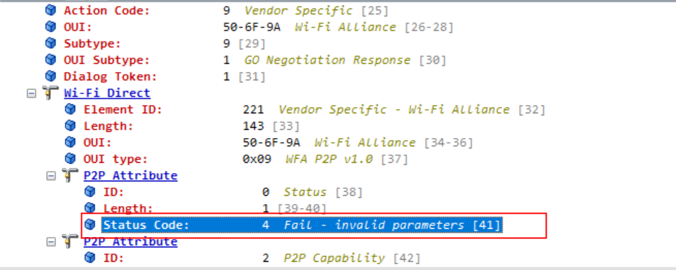 

最后比对WiFi模组向手机发送的ACTION报文内容，发现填充的P2P Device Info的MAC地址值不对，如下：

正确帧内容：

 

错误帧内容：

 

最后经过分析MAC地址的填充部分代码，这个MAC地址是wpa_supplicant 根据p2p0的MAC地址填充的，所以将wdev对象（即p2p-dev-wlan0）的MAC地址更新给p2p0接口，二者保持一致即可，见代码wl_get_vif_macaddr(cfg, 7, p2p_hnetdev->macAddr);的调用。

#### 连接成功日志

##### STA模式连接成功日志

WPA: Key negotiation  ccompleted with 50:eb:f6:02:8e6:d4 [PTK=CCMP GTK=CCMP]

 06 wlan0: State: GROUP_HANDSHAKEc -> COMPLETED

wlan0: CTRL-E4VENT-CONNECTED - Connection to 50:eb:f6:02:8e:d4 completed 3[id=0 id_str=]

WifiWpaReceid eEapol done

##### AP模式连接成功日志

wlan0: STA 96:27:b3:95:b7:6e IEEE 802.1X: au:thorizing port

wlan0: STA 96:27:b3:95:b7:6e WPA: pairwiseb key handshake completed (RSN)

WifiWpaReceiveEapol done

##### P2P模式连接成功日志

P2P: cli_channels:

EAPOL: External notification - portValid=1

EAPOL: External notifica:tion - EAP success=1

EAPOL: SUPP_PAE entering state AUTHENTIwCATING

EAPOL: SUPP_BE enterilng state SUCCESS

EAP: EAP ent_ering state DISABLED

EAPOL: SUPP_PAE entering state AUTHENTICATED

EAPOL:n Supplicant port status: Authoorized

EAPOL: SUPP_BE enteringtstate IDLE

WifiWpaReceiveEapol donepleted - result=SUCCESS

\# ifconfig                                   

lo     Link encap:Local Loopback  

​     inet addr:127.0.0.1  Mask:255.0.0.0 

​     inet6 addr: ::1/128 Scope: Host

​     UP LOOPBACK RUNNING  MTU:65536  Metric:1

​     RX packets:12 errors:0 dropped:0 overruns:0 frame:0 

​     TX packets:12 errors:0 dropped:0 overruns:0 carrier:0 

​     collisions:0 txqueuelen:1000 

​     RX bytes:565 TX bytes:565 

wlan0   Link encap:Ethernet  HWaddr 10:2c:6b:11:61:e0  Driver bcmsdh_sdmmc

​     inet6 addr: fe80::122c:6bff:fe11:61e0/64 Scope: Link

​     UP BROADCAST RUNNING MULTICAST  MTU:1500  Metric:1

​     RX packets:0 errors:0 dropped:0 overruns:0 frame:0 

​     TX packets:0 errors:0 dropped:0 overruns:0 carrier:0 

​     collisions:0 txqueuelen:1000 

​     RX bytes:0 TX bytes:0 

p2p0    Link encap:Ethernet  HWaddr 12:2c:6b:11:61:e0

​     inet6 addr: fe80::102c:6bff:fe11:61e0/64 Scope: Link

​     UP BROADCAST RUNNING MULTICAST  MTU:1500  Metric:1

​     RX packets:0 errors:0 dropped:0 overruns:0 frame:0 

​     TX packets:0 errors:0 dropped:0 overruns:0 carrier:0 

​     collisions:0 txqueuelen:1000 

​     RX bytes:0 TX bytes:0 

p2p-p2p0-0 Link encap:Ethernet  HWaddr 12:2c:6b:11:21:e0  Driver bcmsdh_sdmmc

​     inet6 addr: fe80::102c:6bff:fe11:21e0/64 Scope: Link

​     UP BROADCAST RUNNING MULTICAST  MTU:1500  Metric:1

​     RX packets:0 errors:0 dropped:9 overruns:0 frame:0 

​     TX packets:0 errors:0 dropped:0 overruns:0 carrier:0 

​     collisions:0 txqueuelen:1000 

​     RX bytes:0 TX bytes:0 

# 

## **4G**

### **EC20模块**

EC20模块是移远的一款比较经典的4G通信模组，MCU可以通过USB或者串口来和4G模块进行通信，我们rk3566使用的则是USB接口。

4G模块作为usb device，在加载对应的驱动后会生成ttyUSBx节点，框架层可以通过这些节点使用AT指令或者模块的状态和信息，通过ppp拨号注册一个网卡设备，拨号成功后在命令行可以通过ifconfig -a，可以看到有pppx网卡生成。

### **硬件连接**

从原理图中我们看到我们的4G模块使用的PCIE接口，细心的同学会发现36和38引脚是USBDN和USBDP，也就是说我们使用的是PCIE转USB接口，最终的表现和直接使用USB接口是一样的。

 

因为4G模块使用的是USB接口，对应USB的host功能一定要工作正常，比如USB VBUS的使能，USB设备树的正确配置，kernel config的一些配置都要相应的打开，有的4G模块还有电源使能引脚，也需要在设备树中配置。

### **Kennel修改**

#### **配置VID PID**

在drivers/usb/serial/option.c，添加对应的vid pid，当插入一个新的usb设备，option里相关的USB虚拟串口驱动会匹配vid pid，如果匹配成功，就会生成ttysUSBx节点，具体模块的修改方法在供应商提供的模块的资料里一般都会有，如Linux_USB_Driver_User_Guide

1、option.c增加EC20的pid vid如下，在option_ids结构体中增加：

```
static const struct usb_device_id option_ids[] = {

{ USB_DEVICE(0x2c7c, 0x6002) }, /* Quectel EC20 */
```

### **测试**

1、 在/dev/查看有无ttyUSBx节点，有类似如下节点表明模块配置没有问题。

```
#ls /dev/ttyUSB*

/dev/ttyUSB0 /dev/ttyUSB1 /dev/ttyUSB2 /dev/ttyUSB3
```

2、 AT指令测试，使用microcom串口指令

```
#microcom /dev/ttyUSB2

AT

OK
```

## Vibrator

Vibrator是振动器的意思，也可以被叫做马达，马达旋转或者做直线运动会产生振动。

### **驱动框架模型**

#### Vibrator驱动模型

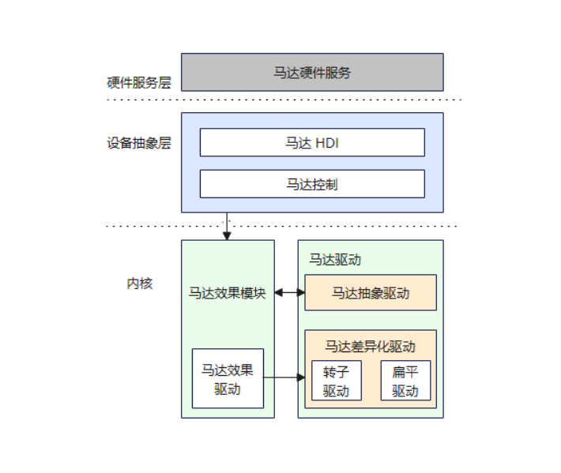

Vibrator驱动按HDF标准框架开发，整体的驱动框架openharmony 主线已经具备，只需要实现具体的器件驱动。Vibrator驱动提供HDI能力接口，支持静态HCS配置的时间序列和动态配置持续时间两种振动效果。调用StartOnce接口动态配置持续振动时间，调用StartEffect接口启动静态配置的振动效果。

### HDF驱动适配

#### HCS配置

配置设备描述信息，在device_info.hcs中添加device_linear_vibrator：

       vibrator :: host {
            hostName = "vibrator_host";
            device_vibrator :: device {
                device0 :: deviceNode {
                    policy = 2;
                    priority = 100;
                    preload = 0;
                    permission = 0664;
                    moduleName = "HDF_VIBRATOR";
                    serviceName = "hdf_misc_vibrator";
                    deviceMatchAttr = "hdf_vibrator_driver";
                }
            }
            device_linear_vibrator :: device {
                device0 :: deviceNode {
                    policy = 1;
                    priority = 105;
                    preload = 0;
                    permission = 0664;
                    moduleName = "HDF_LINEAR_VIBRATOR";
                    serviceName = "hdf_misc_linear_vibrator";
                    deviceMatchAttr = "hdf_linear_vibrator_driver";
                }
            }
        }

配置线性马达器件信息，在linear_vibrator_config.hcs和vibrator_config.hcs中添加器件的特性：

    root{
        linearVibratorConfig {
            boardConfig {
                match_attr = "hdf_linear_vibrator_driver";
                vibratorChipConfig {
                    busType = 1; // 0:i2c 1:gpio
                    gpioNum = 154;
                    startReg = 0;
                    stopReg = 0;
                    startMask = 0;
                }
            }
        }
    }
    
    
    root {
        vibratorConfig {
            boardConfig {
                match_attr = "hdf_vibrator_driver";
                vibratorAttr {
                    /* 0:rotor 1:linear */
                    deviceType = 1;
                    supportPreset = 1;
                }
                vibratorHapticConfig {
                    haptic_clock_timer {
                        effectName = "haptic.clock.timer";
                        type = 1; // 0 means built-in, 1 time series
                        seq = [600, 600, 200, 600]; // time seq
                    }
                    haptic_default_effect {
                        effectName = "haptic.default.effect";
                        type = 0;
                        seq = [0, 3, 800, 1];
                    }
                }
            }
        }
    }

### HDF适配

驱动入口函数实现：

    struct VibratorOps {
        int32_t (*Start)(void);
        int32_t (*StartEffect)(uint32_t effectType);
        int32_t (*Stop)(void);
    };
    
    int32_t InitLinearVibratorDriver(struct HdfDeviceObject *device)
    {
        static struct VibratorOps ops;
        ------
        ops.Start = StartLinearVibrator;
        ops.StartEffect = StartEffectLinearVibrator;
        ops.Stop = StopLinearVibrator;
    
        RegisterVibrator(&ops); 
    
        ParserLinearConfig(device->property, drvData);
    
        GpioSetDir(drvData->gpioNum, GPIO_DIR_OUT);
    }
    
    struct HdfDriverEntry g_linearVibratorDriverEntry = {
        .moduleVersion = 1,
        .moduleName = "HDF_LINEAR_VIBRATOR",
        .Bind = BindLinearVibratorDriver,
        .Init = InitLinearVibratorDriver,
        .Release = ReleaseLinearVibratorDriver,
    };
    
    HDF_INIT(g_linearVibratorDriverEntry);

### 代码分布

./drivers/peripheral/misc/vibrator/chipset/vibrator\_linear\_driver.c  
./vendor/kaihong/khdvk\_3566b/hdf\_config/khdf/device\_info/device\_info.hcs
./vendor/kaihong/khdvk\_3566b/hdf\_config/khdf/vibrator/linear\_vibrator\_config.hcs
./vendor/kaihong/khdvk\_3566b/hdf\_config/khdf/vibrator/vibrator\_config.hcs

### UT测试

代码路径

./drivers/peripheral/misc/vibrator/test/unittest/common/hdf\_vibrator\_test.cpp
./drivers/peripheral/misc/vibrator/test/unittest/hdi/hdf\_vibrator_hdi\_test.cpp

编译UT代码命令

./build.sh --product-name khdvk\_3566b --build-target hdf\_test\_vibrator

生成目标文件路径

./out/khdvk\_3566b/tests/unittest/hdf/vibrator/hdf\_unittest\_vibrator  
./out/khdvk\_3566b/tests/unittest/hdf/vibrator/hdf\_unittest\_hdi\_vibrator 

将编译生成的bin文件 push到开发板上system/bin目录，修改执行权限，执行结果如下

# ./hdfunittest\_hdi\_vibrator

Load parameter\_contexts succes: /system/etc/selinux/targeted/contexts/parameter\_contexts  
Running main() from ../../third_party/googletest/googletest/src/gtest_main.cc  
[==========] Running 14 tests from 1 test case.  
[----------] Global test environment set-up.  
[----------] 14 tests from HdfVibratorHdiTest  
[ RUN      ] HdfVibratorHdiTest.CheckVibratorInstanceIsEmpty  
[       OK ] HdfVibratorHdiTest.CheckVibratorInstanceIsEmpty (0 ms)  
[ RUN      ] HdfVibratorHdiTest.PerformOneShotVibratorDuration\_001  
[       OK ] HdfVibratorHdiTest.PerformOneShotVibratorDuration\_001 (2002 ms)  
[ RUN      ] HdfVibratorHdiTest.PerformOneShotVibratorDuration\_002  
[       OK ] HdfVibratorHdiTest.PerformOneShotVibratorDuration\_002 (2 ms)  
[ RUN      ] HdfVibratorHdiTest.ExecuteVibratorEffect\_001  
[       OK ] HdfVibratorHdiTest.ExecuteVibratorEffect\_001 (5002 ms)  
[ RUN      ] HdfVibratorHdiTest.ExecuteVibratorEffect\_002  
[       OK ] HdfVibratorHdiTest.ExecuteVibratorEffect\_002 (2002 ms)  
[ RUN      ] HdfVibratorHdiTest.ExecuteVibratorEffect\_004  
[       OK ] HdfVibratorHdiTest.ExecuteVibratorEffect\_004 (5005 ms)  
[ RUN      ] HdfVibratorHdiTest.ExecuteVibratorEffect\_005  
[       OK ] HdfVibratorHdiTest.ExecuteVibratorEffect\_005 (5002 ms)  
[ RUN      ] HdfVibratorHdiTest.ExecuteVibratorEffect\_006  
[       OK ] HdfVibratorHdiTest.ExecuteVibratorEffect\_006 (5002 ms)  
[ RUN      ] HdfVibratorHdiTest.ExecuteVibratorEffect\_007  
[       OK ] HdfVibratorHdiTest.ExecuteVibratorEffect\_007 (3 ms)  
#
#
#

# ./hdf\_unittest\_vibrator

Load parameter\_contexts succes: /system/etc/selinux/targeted/contexts/parameter\_contexts  
Running main() from ../../third_party/googletest/googletest/src/gtest\_main.cc  
[==========] Running 16 tests from 1 test case.  
[----------] Global test environment set-up.  
[----------] 16 tests from HdfVibratorTest  
[ RUN      ] HdfVibratorTest.CheckVibratorInstanceIsEmpty  
[       OK ] HdfVibratorTest.CheckVibratorInstanceIsEmpty (0 ms)  
[ RUN      ] HdfVibratorTest.PerformOneShotVibratorDuration\_001  
[       OK ] HdfVibratorTest.PerformOneShotVibratorDuration\_001 (2001 ms)  
[ RUN      ] HdfVibratorTest.PerformOneShotVibratorDuration\_002  
[       OK ] HdfVibratorTest.PerformOneShotVibratorDuration\_002 (0 ms)  
[ RUN      ] HdfVibratorTest.ExecuteVibratorEffect\_001  
[       OK ] HdfVibratorTest.ExecuteVibratorEffect\_001 (5000 ms)  
[ RUN      ] HdfVibratorTest.ExecuteVibratorEffect\_002  
[       OK ] HdfVibratorTest.ExecuteVibratorEffect\_002 (2001 ms)  
[ RUN      ] HdfVibratorTest.ExecuteVibratorEffect\_003  
[       OK ] HdfVibratorTest.ExecuteVibratorEffect\_003 (0 ms)  
[ RUN      ] HdfVibratorTest.ExecuteVibratorEffect\_004  
[       OK ] HdfVibratorTest.ExecuteVibratorEffect\_004 (5001 ms)  
[ RUN      ] HdfVibratorTest.ExecuteVibratorEffect\_005  
[       OK ] HdfVibratorTest.ExecuteVibratorEffect\_005 (5000 ms)  
[ RUN      ] HdfVibratorTest.ExecuteVibratorEffect\_006  
[       OK ] HdfVibratorTest.ExecuteVibratorEffect\_006 (5000 ms)  
[ RUN      ] HdfVibratorTest.ExecuteVibratorEffect\_007  
[       OK ] HdfVibratorTest.ExecuteVibratorEffect\_007 (1 ms)  
#
#
#
